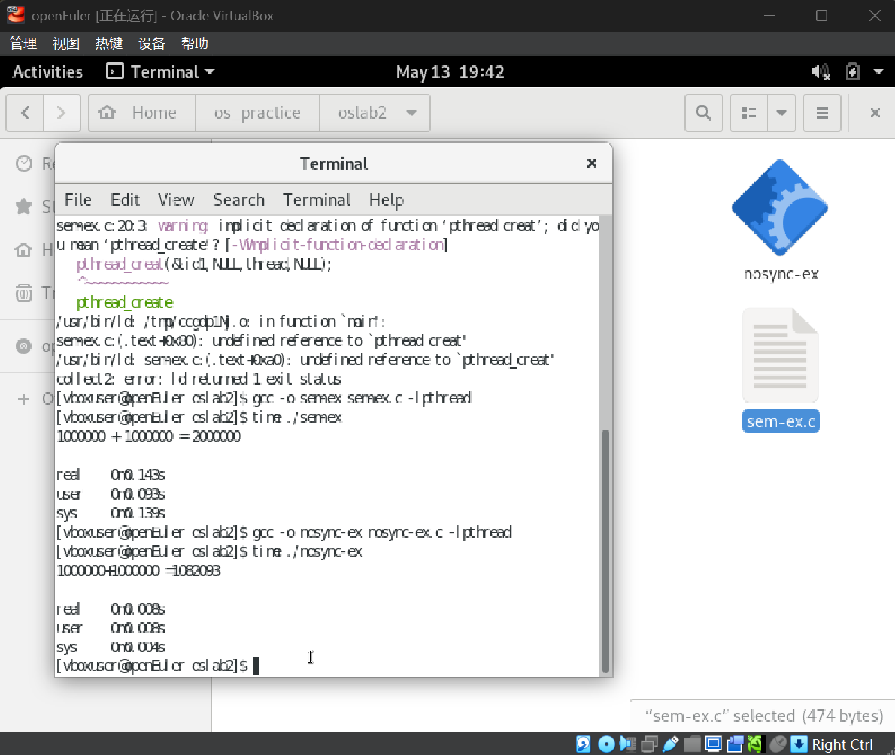
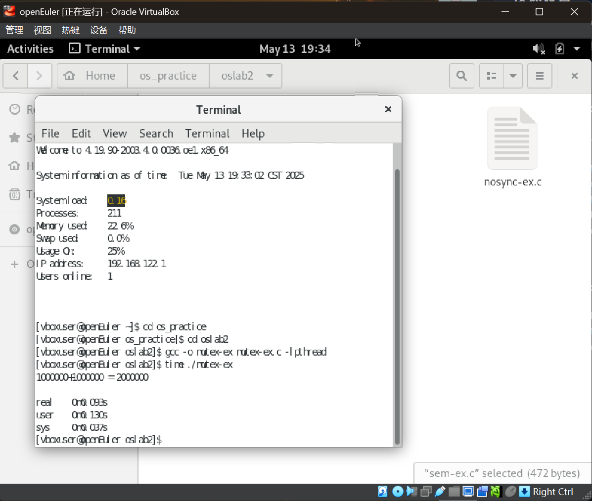
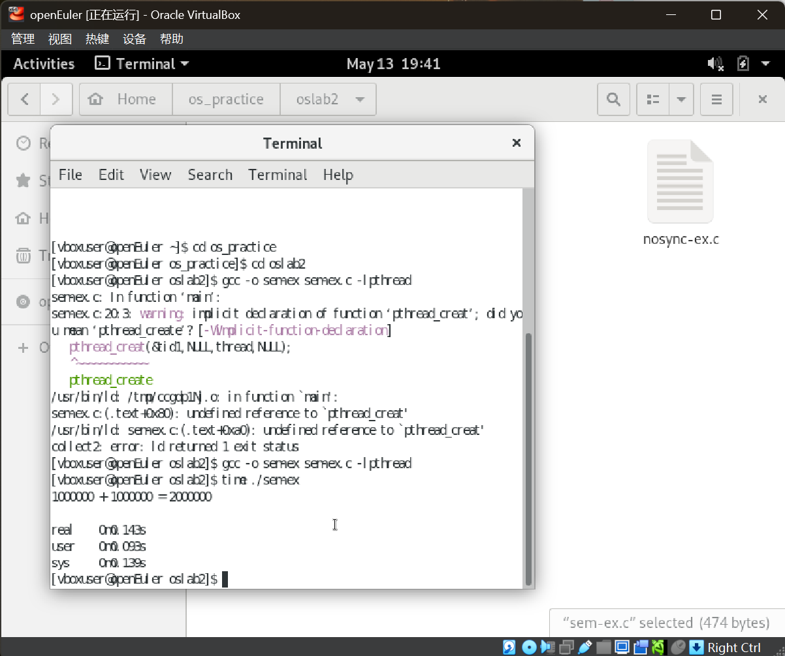
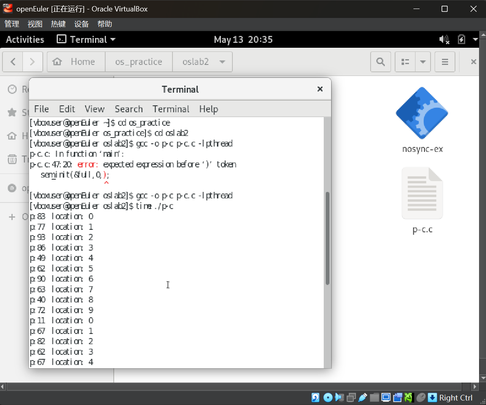
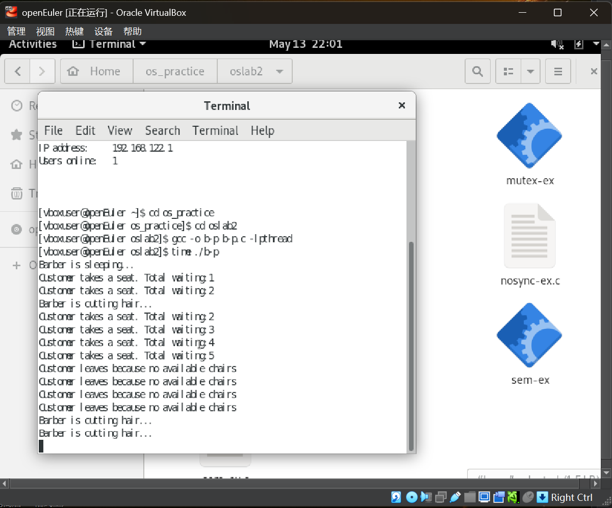

# 实验二：作业

---

## 任务1：熟悉pthread编程

### 1.1 无同步机制的程序 (nosync-ex.c)

#### 执行结果与分析


### 1.2 使用互斥锁的程序 (mutex-ex.c)

#### 执行结果与分析


### 1.3 使用信号量的程序 (sem-ex.c)

#### 执行结果与分析


### 1.4 三种实现方式的对比分析

| 特性        | nosync-ex.c       | mutex-ex.c       | sem-ex.c        |
|------------|------------------|------------------|-----------------|
| 同步机制     | 无               | 互斥锁            | 信号量           |
| 执行结果     | 不正确(~994690)   | 正确(2000000)     | 正确(2000000)    |
| 执行时间     | 最快(~0.013s)     | 中等(~0.211s)     | 最慢(~0.306s)    |
| 适用场景     | 无共享资源        | 一般临界区保护      | 复杂同步场景      |
| 实现复杂度   | 最简单            | 中等              | 较高            |

**结论**：
1. 无同步机制的程序虽然执行快，但结果不可靠
2. 互斥锁和信号量都能保证正确性，但带来性能开销
3. 互斥锁更适合简单的临界区保护，信号量更适合复杂的同步场景

## 任务2：生产者消费者问题实现

### 代码实现

```c
#include <stdio.h>
#include <stdlib.h>
#include <pthread.h>
#include <semaphore.h>
#include <unistd.h>

#define BUFFER_SIZE 10
int buffer[BUFFER_SIZE];
int in = 0, out = 0;
sem_t empty;
sem_t full;
pthread_mutex_t mutex;

// 生产者线程函数
void* producer(void *arg) {
    while (1) {
        int item = rand() % 100; // 生产数据
        sem_wait(&empty); // 等待空槽
        pthread_mutex_lock(&mutex); // 加锁
        buffer[in] = item; // 放入数据
        printf("生产者生产数据 %d 放入缓冲区位置 %d\n", item, in);
        in = (in + 1) % BUFFER_SIZE; // 更新索引
        pthread_mutex_unlock(&mutex); // 解锁
        sem_post(&full); // 释放满信号量
        sleep(rand() % 2); // 模拟生产时间
    }
    return NULL;
}

// 消费者线程函数
void* consumer(void *arg) {
    while (1) {
        sem_wait(&full); // 等待有数据
        pthread_mutex_lock(&mutex); // 加锁
        int item = buffer[out]; // 取出数据
        printf("消费者消费数据 %d 从缓冲区位置 %d\n", item, out);
        out = (out + 1) % BUFFER_SIZE; // 更新索引
        pthread_mutex_unlock(&mutex); // 解锁
        sem_post(&empty); // 释放空信号量
        sleep(rand() % 3); // 模拟消费时间
    }
    return NULL;
}

int main() {
    pthread_t prod_thread, cons_thread; // 生产者和消费者线程
    sem_init(&empty, 0, BUFFER_SIZE); // 初始化空信号量
    sem_init(&full, 0, 0); // 初始化满信号量
    pthread_mutex_init(&mutex, NULL); // 初始化互斥锁

    pthread_create(&prod_thread, NULL, producer, NULL); // 创建生产者线程
    pthread_create(&cons_thread, NULL, consumer, NULL); // 创建消费者线程

    pthread_join(prod_thread, NULL); // 等待生产者线程结束
    pthread_join(cons_thread, NULL); // 等待消费者线程结束

    sem_destroy(&empty); // 销毁信号量
    sem_destroy(&full);
    pthread_mutex_destroy(&mutex); // 销毁互斥锁
    return 0;
}
```

### 运行结果
程序正确实现了生产者消费者模型，没有出现缓冲区溢出或消费空缓冲区的情况。


## 任务3：代码阅读理解

### 3.1 pthread-ex01 分析

**理解验证**：该程序展示了如何通过pthread_exit()传递线程返回值，并通过pthread_join()获取返回值。

### 3.2 pthread-ex02 分析

**关键区别**：`exit()`会终止整个进程，而`pthread_exit()`只终止当前线程。

### 3.3 pthread-ex03 分析

**线程执行顺序**：由于没有同步机制，thread2可能先执行导致输出0，结果不确定。

### 3.4 pthread-ex04 分析

**关键点**：已分离的线程不能被join，可能导致未定义行为。

### 3.5 pthread-ex05 分析

**竞态条件**：两个线程对全局变量i的访问没有同步，输出结果不确定。

### 3.6 pthread-ex06 分析

**内存管理**：为每个线程分配独立内存并在线程中释放，避免了数据竞争。

### 3.7 pthread-ex07 分析

**问题分析**：两个线程共享局部变量i的地址，可能导致数据竞争和不可预测的输出。

## 任务4：理发师问题实现

### 问题分析
理发师问题需要协调：
1. 理发师在没有顾客时睡觉
2. 顾客到达时唤醒理发师或等待/离开
3. 有限数量的等待椅子

### 伪代码实现

```
# 定义信号量
semaphore customers = 0  # 等待的顾客数
semaphore barber = 0     # 理发师状态
semaphore accessSeats = 1 # 互斥访问等待椅
int freeSeats = N        # 空闲椅子数

# 理发师进程
while true:
    wait(customers)      # 无顾客则睡觉
    wait(accessSeats)    # 获取椅子访问权
    freeSeats++          # 一个顾客离开等待区
    signal(barber)       # 准备理发
    signal(accessSeats)  # 释放椅子访问权
    cut_hair()           # 理发(临界区)

# 顾客进程
wait(accessSeats)       # 获取椅子访问权
if freeSeats > 0:
    freeSeats--          # 占用一个椅子
    signal(customers)    # 通知理发师
    signal(accessSeats)  # 释放椅子访问权
    wait(barber)         # 等待理发师
    get_haircut()        # 接受理发服务
else:
    signal(accessSeats)  # 没有座位，离开
    leave()
```

### 代码实现

```c
#include <pthread.h>
#include <stdio.h>
#include <stdlib.h>
#include <unistd.h>

#define NUM_CHAIRS 5

pthread_mutex_t mutex = PTHREAD_MUTEX_INITIALIZER;
pthread_cond_t barber_sleep = PTHREAD_COND_INITIALIZER;
pthread_cond_t customer_wait = PTHREAD_COND_INITIALIZER;

int waiting_customers = 0;

void* barber(void* arg) {
    while (1) {
        pthread_mutex_lock(&mutex);

        while (waiting_customers == 0) {
            printf("Barber is sleeping...\n");
            pthread_cond_wait(&barber_sleep, &mutex);
        }

        printf("Barber is cutting hair...\n");
        waiting_customers--;

        pthread_mutex_unlock(&mutex);

        sleep(rand() % 3 + 1);
    }
}

void* customer(void* arg) {
    pthread_mutex_lock(&mutex);

    if (waiting_customers < NUM_CHAIRS) {
        waiting_customers++;
        printf("Customer takes a seat. Total waiting: %d\n", waiting_customers);

        pthread_cond_signal(&barber_sleep);

        pthread_mutex_unlock(&mutex);

        sleep(rand() % 5 + 1);
    } else {
        printf("Customer leaves because no available chairs.\n");
        pthread_mutex_unlock(&mutex);
    }

    pthread_exit(NULL);
}

int main() {
    pthread_t barber_thread, customer_threads[NUM_CHAIRS + 5];
    srand(time(NULL));
    pthread_create(&barber_thread, NULL, barber, NULL);
    for (int i = 0; i < NUM_CHAIRS + 5; i++) {
        pthread_create(&customer_threads[i], NULL, customer, NULL);
    }
    pthread_join(barber_thread, NULL);
    for (int i = 0; i < NUM_CHAIRS + 5; i++) {
        pthread_join(customer_threads[i], NULL);
    }
    return 0;
}
```

### 运行结果



## 实验总结

通过本次实验：
1. 掌握了pthread多线程编程的基本方法
2. 理解了互斥锁、信号量等同步机制的原理和应用
3. 成功实现了经典的生产者消费者问题和理发师问题
4. 加深了对线程同步和并发控制的理解

实验过程中使用git进行版本控制，详细记录了代码和报告的修改过程。