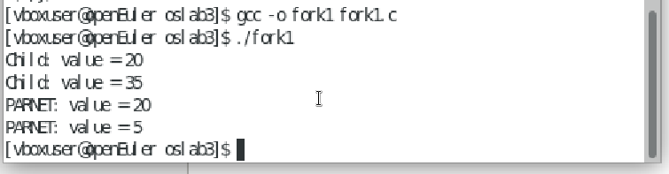
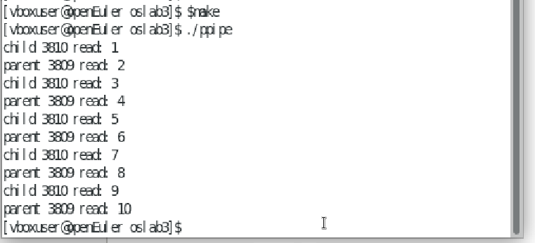
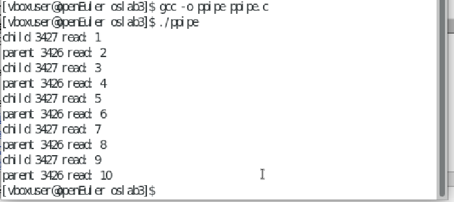
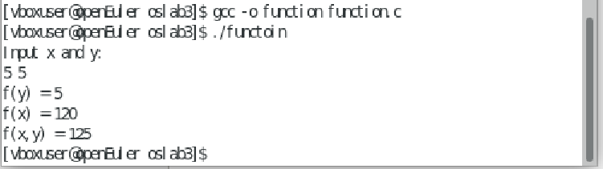

# 实验三：任务

---

## 任务一：阅读文档Linux中fork()函数详解，了解如何编程实现进程创建

#### 1. `fork()` 的工作原理

- 当调用 `fork()` 时，操作系统会为子进程分配新的内存空间，并将父进程的代码和数据段复制到子进程中。
- 子进程几乎与父进程完全相同，但它们是独立的实体，有自己的地址空间。
- 父进程和子进程的执行流在 `fork()` 调用后会分叉，各自独立执行。

#### 2. `fork()` 的返回值

- **父进程**：返回子进程的 PID，用于父进程标识和管理子进程。
- **子进程**：返回 `0`，表示子进程自身。
- **失败**：返回 `-1`，并设置错误码 `errno`。

#### 3. `fork()` 的编程实现
以下是一个简单的 `fork()` 使用示例，展示了如何创建子进程并让父子进程执行不同的代码：

```c
#include <stdio.h>
#include <unistd.h>
#include <sys/types.h>

int main() {
    printf("创建子进程前，当前进程的 PID：%d\n", getpid());
    pid_t pid = fork();

    if (pid == 0) {
        // 子进程
        printf("子进程，PID：%d，父进程 PID：%d\n", getpid(), getppid());
    } else if (pid > 0) {
        // 父进程
        printf("父进程，PID：%d，子进程 PID：%d\n", getpid(), pid);
    } else {
        // 错误处理
        perror("fork failed");
        return 1;
    }
    return 0;
}
```

#### 4. `fork()` 的应用场景

- **并发处理**：父进程可以继续执行其他任务，而子进程可以独立完成特定任务。
- **多任务处理**：例如，父进程可以处理用户请求，子进程可以执行具体的任务。
- **资源隔离**：子进程和父进程各自独立，互不干扰。

#### 5. 注意事项

- **资源管理**：子进程会继承父进程的资源，但它们是独立的，修改子进程的资源不会影响父进程。
- **进程同步**：父进程可以通过 `wait()` 或 `waitpid()` 等待子进程结束。
- **性能考虑**：虽然 `fork()` 是轻量级的，但创建大量子进程可能会消耗系统资源。

## 任务二：输入代码并观察、解释输出结果fork1.c，看注释思考问题。

### 输出结果



#### 解释输出结果

父进程首次进入 `for` 循环时，`i` 的值为 0。此时，父进程创建了一个子进程，命名为子进程 1。接着，父进程进入到 `else if` 分支中，在 `wait(NULL)` 这一行被阻塞，等待子进程 1 的结束。

子进程 1 进入了 `if` 分支，将 `value` 的值增加 15 后变成 20，并打印出 “Child: value = 20”。第一次循环结束时，`i` 的值递增变为 1。

当循环进行到第二次时，子进程 1 又创建了一个新的子进程，即子进程 2，此时子进程 1 的角色转变为父进程。子进程 1 进入 `else if` 分支，在 `wait(NULL)` 处等待子进程 2 完成。

子进程 2 同样进入 `if` 分支，再次将 `value` 增加 15，此时值变为 35，并输出 “Child: value = 35”。第二次循环结束后，`i` 的值再次递增到 2，不再满足循环条件，循环终止，子进程 2 随之结束。

随后，子进程 1 恢复执行，解除阻塞状态，并输出 “PARNET: value = 20”，子进程 1 也宣告结束。父进程也随之解除阻塞，输出 “PARNET: value = 5”。

如果没有 `exit(0)` 这行代码，子进程 1 在完成第一次循环后，不会立即退出，而是继续执行。此时，`i` 的值递增到 2，导致循环条件不满足，循环结束。父进程同样不会立即退出，`i` 的值变为 1，并创建另一个子进程，称为子进程 3。此时，父进程进入 `else if` 分支，在 `wait(NULL)` 处等待子进程 3 的完成。

子进程 3 执行 `if` 分支中的代码，`value` 增加 15 后变为 20，打印出 “Child: value = 20”。第一次循环结束后，`i` 的值变为 2，不再满足循环条件，循环结束，子进程 3 也就此结束。

最终，父进程解除阻塞状态，输出 “PARNET: value = 5”，父进程结束。父进程再次解除阻塞状态，输出 “PARNET: value = 5”。


### 注释解答

#### 1. 全局变量和局部变量的位置

```c
int value = 5;  // where?
```

- **`value` 是一个全局变量**，它定义在 `main` 函数之外。全局变量在程序的整个生命周期中都存在，并且在所有函数中都可以访问。它存储在程序的全局数据段中。

```c
int i;  // where?
```

- **`i` 是一个局部变量**，它定义在 `main` 函数中。局部变量只在定义它的函数内部有效，存储在函数的栈帧中。当函数执行完毕后，局部变量的存储空间会被释放。

#### 2. `fork()` 的行为

```c
pid = fork();
```

- `fork()` 是一个系统调用，用于创建一个子进程。它会复制当前进程（父进程）的地址空间，创建一个几乎完全相同的子进程。
- `fork()` 的返回值：
  - 在父进程中返回子进程的 PID（一个正整数）。
  - 在子进程中返回 0。
  - 如果创建失败，返回 -1。

#### 3. 循环中的 `fork()`

```c
for (i = 0; i < 2; i++) {  // How many new processes and printfs?
    pid = fork();
    if (pid == 0) {
        value += 15;
        printf("Child: value = %d\n", value);
    } else if (pid > 0) {
        wait(NULL);  // 使父进程等待子进程结束
        printf("PARNET: value = %d\n", value);
        exit(0);  // Notice: What will happen with or without this line?
    }
}
```

- **循环执行两次**，每次都会调用 `fork()` 创建一个子进程。
- **第一次循环**：
  - 父进程调用 `fork()`，创建一个子进程。
  - 子进程执行 `value += 15`，并将 `value` 的值打印为 20。
  - 父进程调用 `wait(NULL)`，等待子进程结束，然后打印 `PARNET: value = 5`。
  - 父进程调用 `exit(0)`，退出程序。
- **第二次循环**：
  - 由于父进程在第一次循环中已经退出，第二次循环不会执行。
  - 因此，只有第一次循环的子进程会执行。

#### 4. `wait(NULL)` 的作用

```c
wait(NULL);  // 使父进程等待子进程结束
```

- `wait(NULL)` 使父进程等待子进程结束，防止子进程成为僵尸进程。
- 由于 `wait(NULL)` 的参数是 `NULL`，它不会获取子进程的退出状态。

#### 5. `exit(0)` 的影响

```c
exit(0);  // Notice: What will happen with or without this line?
```

- **有 `exit(0)` 的情况**：
  - 父进程在第一次循环中调用 `exit(0)`，退出程序。
  - 第二次循环不会执行。
- **没有 `exit(0)` 的情况**：
  - 父进程会继续执行第二次循环，再次调用 `fork()` 创建一个子进程。
  - 第二次循环的子进程也会执行 `value += 15`，并将 `value` 的值打印为 20。
  - 父进程会再次调用 `wait(NULL)`，等待第二次循环的子进程结束，然后打印 `PARNET: value = 5`。

## 任务三：掌握如何通过管道实现进程间通信。

### 1. 阅读示例的代码，编译执行，并加以理解。

#### 使用 `Makefile` 编译



#### 运行



### 2. 独立实验

#### 代码

```c
#include <stdio.h>
#include <stdlib.h>
#include <sys/types.h>
#include <unistd.h>
#include <sys/wait.h> 

int fx(int x) {
    if (x == 1)
        return 1;
    return x * fx(x - 1);
}

int fy(int y) {
    if (y == 1 || y == 2)
        return 1;
    return fy(y - 1) + fy(y - 2);
}

int main() {
    pid_t pid_fx, pid_fy;
    int x, y;
    int pipe_fx[2], pipe_fy[2];
    int result_fx, result_fy;

    printf("Input x and y:\n");
    if (scanf("%d %d", &x, &y) != 2) {
        fprintf(stderr, "Invalid input\n");
        return 1;
    }

    // 创建管道
    if (pipe(pipe_fx) < 0 || pipe(pipe_fy) < 0) {
        perror("Failed to create pipes");
        exit(EXIT_FAILURE);
    }

    // 创建第一个子进程计算 f(x)
    pid_fx = fork();
    if (pid_fx < 0) {
        perror("Failed to create new process for f(x)");
        exit(EXIT_FAILURE);
    } else if (pid_fx == 0) {
        // 子进程计算 f(x)
        close(pipe_fx[0]);  // 关闭读端
        result_fx = fx(x);
        write(pipe_fx[1], &result_fx, sizeof(result_fx));  // 写入结果
        close(pipe_fx[1]);  // 关闭写端
        exit(0);
    }

    // 创建第二个子进程计算 f(y)
    pid_fy = fork();
    if (pid_fy < 0) {
        perror("Failed to create new process for f(y)");
        exit(EXIT_FAILURE);
    } else if (pid_fy == 0) {
        // 子进程计算 f(y)
        close(pipe_fy[0]);  // 关闭读端
        result_fy = fy(y);
        write(pipe_fy[1], &result_fy, sizeof(result_fy));  // 写入结果
        close(pipe_fy[1]);  // 关闭写端
        exit(0);
    }

    // 父进程等待两个子进程结束
    waitpid(pid_fx, NULL, 0);
    waitpid(pid_fy, NULL, 0);

    // 父进程从管道读取结果
    close(pipe_fx[1]);  // 关闭写端
    close(pipe_fy[1]);  // 关闭写端
    read(pipe_fx[0], &result_fx, sizeof(result_fx));  // 读取 f(x) 的结果
    read(pipe_fy[0], &result_fy, sizeof(result_fy));  // 读取 f(y) 的结果
    close(pipe_fx[0]);  // 关闭读端
    close(pipe_fy[0]);  // 关闭读端

    // 父进程计算 f(x) + f(y)
    printf("f(x, y) = %d\n", result_fx + result_fy);

    return 0;
}
```

#### 运行结果


