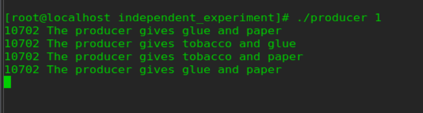

# 进程同步实验报告

---

## 1. 真实操作系统中并发进程同步机制的实现和应用

在真实操作系统中，提供了多种并发进程同步机制，如信号量（Semaphore）、共享内存（Shared Memory）和消息队列（Message Queue）等。这些机制在实验中得到了充分的体现和应用。

### 生产者/消费者问题的实现

在生产者/消费者问题中，使用了信号量来实现同步和互斥。生产者和消费者共享一个有界缓冲区，信号量用于控制对缓冲区的访问。

- **同步信号量**：
  - `prod_sem`：用于生产者的同步，初始值为缓冲区的大小（表示缓冲区中可用的空闲位置数量）。生产者在向缓冲区放入产品前会调用`down(prod_sem)`，如果缓冲区已满（`prod_sem`的值为0），生产者会被阻塞。当消费者从缓冲区取出产品后，会调用`up(prod_sem)`，唤醒生产者。
  - `cons_sem`：用于消费者的同步，初始值为0（表示缓冲区中没有产品可供消费）。消费者在从缓冲区取出产品前会调用`down(cons_sem)`，如果缓冲区为空（`cons_sem`的值为0），消费者会被阻塞。当生产者放入产品后，会调用`up(cons_sem)`，唤醒消费者。

- **互斥信号量**：
  - `pmtx_sem`：用于生产者对缓冲区的互斥访问，初始值为1（表示缓冲区可以被访问）。当一个生产者正在向缓冲区放入产品时，其他生产者会被阻塞。
  - `cmtx_sem`：用于消费者对缓冲区的互斥访问，初始值为1（表示缓冲区可以被访问）。当一个消费者正在从缓冲区取出产品时，其他消费者会被阻塞。

### 抽烟者问题的实现

在抽烟者问题中，同样可以使用信号量来实现同步和互斥。假设三个抽烟者进程分别为`smoker1`、`smoker2`和`smoker3`，分别持有烟草、纸和火柴。两个供应者进程分别为`supplier1`和`supplier2`，它们轮流提供两种材料。

- **同步信号量**：
  - 设置三个信号量`smoker1_sem`、`smoker2_sem`和`smoker3_sem`，分别表示三个抽烟者是否可以卷烟。初始时，所有信号量的值为0。
  - 当供应者提供了两种材料后，会检查哪种材料缺失，并将对应的信号量加1，唤醒持有缺失材料的抽烟者。

- **互斥信号量**：
  - 设置一个互斥信号量`mutex`，用于保护对材料的访问。当供应者提供材料时，会先获取互斥信号量，然后更新材料的状态；当抽烟者卷烟时，也会先获取互斥信号量，然后检查是否拥有所有需要的材料。

## 2. 信号量机制的互斥和同步

### 互斥

信号量用于互斥时，通常初始化为1，表示资源可用。当一个进程需要访问共享资源时，会调用`down`操作，将信号量减1。如果信号量的值变为负数，表示资源已被占用，进程会被阻塞。当进程访问完共享资源后，会调用`up`操作，将信号量加1，唤醒等待的进程。

在实验中，生产者和消费者对共享缓冲区的访问使用了互斥信号量。例如，生产者在向缓冲区放入产品前会调用`down(pmtx_sem)`，如果`pmtx_sem`的值为0，表示另一个生产者正在访问缓冲区，当前生产者会被阻塞；当生产者访问完缓冲区后，会调用`up(pmtx_sem)`，释放缓冲区。

### 同步

信号量用于同步时，通常初始化为0，表示没有可用资源。当一个进程需要等待某个事件发生时，会调用`down`操作，将信号量减1。如果信号量的值变为负数，表示事件尚未发生，进程会被阻塞。当另一个进程完成事件后，会调用`up`操作，将信号量加1，唤醒等待的进程。

在实验中，生产者和消费者之间的同步使用了同步信号量。例如，生产者在向缓冲区放入产品前会调用`down(prod_sem)`，如果`prod_sem`的值为0，表示缓冲区已满，生产者会被阻塞；当消费者从缓冲区取出产品后，会调用`up(prod_sem)`，唤醒生产者。

## 3. 信号量的初值和值变化的物理意义

### 初值

- **同步信号量**：
  - 同步信号量的初值通常表示可用资源的数量。在生产者/消费者问题中，`prod_sem`的初值为缓冲区的大小，表示缓冲区中可用的空闲位置数量；`cons_sem`的初值为0，表示缓冲区中没有产品可供消费。

- **互斥信号量**：
  - 互斥信号量的初值通常为1，表示资源可用。在实验中，`pmtx_sem`和`cmtx_sem`的初值为1，表示缓冲区可以被访问。

### 值变化

- **`down`操作**：
  - 将信号量减1，表示占用资源。如果信号量的值变为负数，表示资源不足，进程会被阻塞。

- **`up`操作**：
  - 将信号量加1，表示释放资源。如果信号量的值大于0，表示资源可用，会唤醒等待的进程。

在实验中，信号量的值变化直接控制了生产者和消费者的行为。例如，当生产者放入产品后，缓冲区中的空闲位置数量减少，`prod_sem`的值减1；当消费者取出产品后，缓冲区中的产品数量减少，`cons_sem`的值减1。同时，生产者和消费者会根据信号量的值决定是否继续执行或进入阻塞状态。

## 4. 实验程序的测试和结果分析

在实验中，使用了多个生产者和消费者进程，以不同的启动顺序和执行速率进行测试，验证了示例程序和独立实验程序是否满足同步要求。

### 测试结果

- **实例实验程序结果展示**：
  - 
  - 
  - 
  - 
  - 

- **独立实验程序结果展示**：
  - 
  - 
  - 
  - 
  - 

### 学习心得

通过本次实验，我深入理解了并发进程同步机制的重要性及其在操作系统中的应用。信号量作为一种高效的同步工具，能够有效解决生产者/消费者问题和抽烟者问题等经典并发问题。通过实践，我掌握了信号量的使用方法，包括初始化、`down`操作和`up`操作，并学会了如何通过信号量实现进程间的同步和互斥。

实验过程中，我意识到并发编程的复杂性和挑战性。进程间的同步和互斥需要精心设计，以避免死锁、饥饿和竞态条件等问题。同时，我也认识到信号量的初值和值变化对进程行为的直接影响，合理设置信号量的初值是实现正确同步的关键。

此外，通过对比不同启动顺序和执行速率下的测试结果，我进一步理解了并发系统的非确定性。在实际应用中，需要充分考虑并发环境下的各种可能性，并通过严格的测试验证程序的正确性和可靠性。

总之，本次实验不仅加深了我对操作系统并发机制的理解，还提升了我在并发编程中的实践能力。我将这些知识应用到未来的学习和工作中，更好地设计和实现高效的并发系统。

---