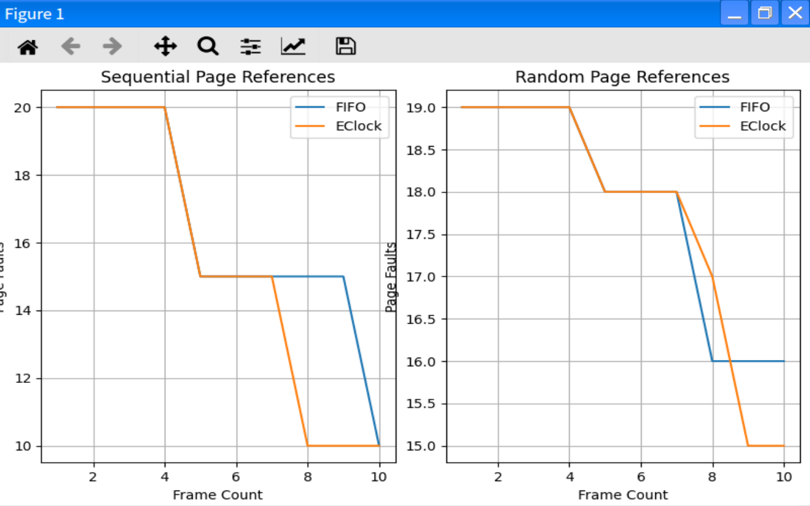

# 内存页面置换算法实验

---

github地址：[https://github.com/nagyan78/bookish-spoon](https://github.com/nagyan78/bookish-spoon)

## 测试组及现象

  1. **顺序引用串（如 1，2，3，4，5，6，7，8，9，10...）**
     * **FIFO** ：帧数少时频繁淘汰即将再次访问的页面，缺页次数多。
     * **LRU** ：能很好保留后续可能访问的页面，缺页次数少。
     * **Clock** ：帧数不足时缺页率高，效果类似 FIFO。
     * **EClock** ：若页面多被修改，可能过早淘汰需用页面。
     * **LFU** ：初始随机淘汰页面，缺页次数多。
     * **MFU** ：易错误淘汰后续需访问页面，缺页次数多。

  2. **随机引用串（如 1，3，6，2，8，5，7，4，9，1...）**
     * **FIFO** ：表现不佳，缺页次数多。
     * **LRU** ：缺页次数相对少，适应随机访问。
     * **Clock** ：缺页次数比 FIFO 少，但不如 LRU。
     * **EClock** ：若页面多被修改，缺页次数增加。
     * **LFU** ：初始缺页多，后期缺页次数下降。
     * **MFU** ：缺页次数较多。

  3. **循环引用串（如 1，2，3，1，2，3，1，2，3...）**
     * **FIFO** ：帧数少时频繁缺页。
     * **LRU** ：能很好适应循环模式，缺页次数少。
     * **Clock** ：帧数少时缺页多，帧数增加缺页减少。
     * **EClock** ：若页面多被修改，缺页次数可能增加。
     * **LFU** ：缺页次数较多。
     * **MFU** ：缺页次数多。

  4. **局部性引用串（如 1，2，3，4，5，1，2，3，6，7，8，1，2，3...）**
     * **FIFO** ：初始装入页面后，再次访问时缺页多。
     * **LRU** ：保留频繁访问页面，缺页次数少。
     * **Clock** ：缺页次数逐渐减少，但不如 LRU 显著。
     * **EClock** ：若页面多被修改，缺页次数可能增加。
     * **LFU** ：保留高频页面，缺页次数逐渐下降。
     * **MFU** ：缺页次数多。

## 先进先出置换算法(FIFO)

```c++
void Replace::Fifo(void) {
    InitSpace("FIFO");
    int pointer = 0;                     // 指向下一个要替换的页面
    bool* used = new bool[FrameNumber];  // 用于记录页面是否被访问过
    int eliminateIndex = 0;              // 用于记录淘汰页的索引

    for (int i = 0; i < FrameNumber; i++) {
        used[i] = false;
    }

    for (int k = 0; k < PageNumber; k++) {
        int next = ReferencePage[k];
        bool found = false;

        // 检查页面是否在帧中
        for (int i = 0; i < FrameNumber; i++) {
            if (PageFrames[i] == next) {
                found = true;
                used[i] = true;  // 将页面标记为已访问
                break;
            }
        }

        if (!found) {
            FaultNumber++;
            // 找到一个没有被访问过的页面进行替换
            while (used[pointer]) {
                pointer = (pointer + 1) % FrameNumber;
            }

            // 记录被淘汰的页面
            if (PageFrames[pointer] != -1) {
                EliminatePage[eliminateIndex++] = PageFrames[pointer];
            }

            // 进行页面替换
            PageFrames[pointer] = next;
            used[pointer] = true;
        }

        // 报告当前实存中页号
        for (int j = 0; j < FrameNumber; j++) {
            if (PageFrames[j] >= 0)
                cout << PageFrames[j] << " ";
        }
        if (!found && eliminateIndex > 0 &&
            EliminatePage[eliminateIndex - 1] > 0)  
            cout << "->" << EliminatePage[eliminateIndex - 1] << endl;
        else
            cout << endl;
    }

    delete[] used;
    Report();
}
```

## 最近最久未使用置换算法(LRU)

```c++
void Replace::Lru(void) {
    InitSpace("LRU");
    int pointer = 0;                     // 指向下一个要替换的页面
    bool* used = new bool[FrameNumber];  // 用于记录页面是否被访问过
    int eliminateIndex = 0;              // 用于记录淘汰页的索引
    int* lastUsed = new int[FrameNumber];  // 用于记录页面上次被访问的时间

    for (int i = 0; i < FrameNumber; i++) {
        used[i] = false;
        lastUsed[i] = -1;
    }

    for (int k = 0; k < PageNumber; k++) {
        int next = ReferencePage[k];
        bool found = false;

        // 检查页面是否在帧中
        for (int i = 0; i < FrameNumber; i++) {
            if (PageFrames[i] == next) {
                found = true;
                used[i] = true;  // 将页面标记为已访问
                lastUsed[i] = k;  // 更新页面上次被访问的时间
                break;
            }
        }

        if (!found) {
            FaultNumber++;
            // 找到一个没有被访问过的页面进行替换
            int minLastUsedIndex = 0;
            for (int i = 1; i < FrameNumber; i++) {
                if (lastUsed[i] < lastUsed[minLastUsedIndex]) {
                    minLastUsedIndex = i;
                }
            }

            // 记录被淘汰的页面
            if (PageFrames[minLastUsedIndex] != -1) {
                EliminatePage[eliminateIndex++] = PageFrames[minLastUsedIndex];
            }

            // 进行页面替换
            PageFrames[minLastUsedIndex] = next;
            used[minLastUsedIndex] = true;
            lastUsed[minLastUsedIndex] = k;
        }

        // 报告当前实存中页号
        for (int j = 0; j < FrameNumber; j++) {
            if (PageFrames[j] >= 0)
                cout << PageFrames[j] << " ";
        }
        if (!found && eliminateIndex > 0 &&
            EliminatePage[eliminateIndex - 1] > 0)
            cout << "->" << EliminatePage[eliminateIndex - 1] << endl;
        else
            cout << endl;
    }

    delete[] used;
    delete[] lastUsed;
    Report();
}
```

## 时钟（二次机会）置换算法(Clock)

```c++
void Replace::Clock(void) {
    InitSpace("Clock");
    int pointer = 0;                     // 指向下一个要替换的页面
    bool* used = new bool[FrameNumber];  // 用于记录页面是否被访问过
    int eliminateIndex = 0;              // 用于记录淘汰页的索引

    for (int i = 0; i < FrameNumber; i++) {
        used[i] = false;
    }

    for (int k = 0; k < PageNumber; k++) {
        int next = ReferencePage[k];
        bool found = false;

        // 检查页面是否在帧中
        for (int i = 0; i < FrameNumber; i++) {
            if (PageFrames[i] == next) {
                found = true;
                used[i] = true;  // 将页面标记为已访问
                break;
            }
        }

        if (!found) {
            FaultNumber++;
            // 找到一个没有被访问过的页面进行替换
            while (used[pointer]) {
                used[pointer] = false;
                pointer = (pointer + 1) % FrameNumber;
            }

            // 记录被淘汰的页面
            if (PageFrames[pointer] != -1) {
                EliminatePage[eliminateIndex++] = PageFrames[pointer];
            }

            // 进行页面替换
            PageFrames[pointer] = next;
            used[pointer] = true;
            pointer = (pointer + 1) % FrameNumber;
        }

        // 报告当前实存中页号
        for (int j = 0; j < FrameNumber; j++) {
            if (PageFrames[j] >= 0)
                cout << PageFrames[j] << " ";
        }
        if (!found && eliminateIndex > 0 &&
            EliminatePage[eliminateIndex - 1] > 0)
            cout << "->" << EliminatePage[eliminateIndex - 1] << endl;
        else
            cout << endl;
    }

    delete[] used;
    Report();
}
```

## 增强二次机会置换算法(Eclock)

```c++
void Replace::Eclock(void) {
    InitSpace("EClock");
    int pointer = 0;                     // 指向下一个要替换的页面
    bool* used = new bool[FrameNumber];  // 用于记录页面是否被访问过
    bool* modified = new bool[FrameNumber];  // 用于记录页面是否被修改过
    int eliminateIndex = 0;                  // 用于记录淘汰页的索引

    for (int i = 0; i < FrameNumber; i++) {
        used[i] = false;
        modified[i] = false;
    }

    for (int k = 0; k < PageNumber; k++) {
        int next = ReferencePage[k];
        bool found = false;

        // 检查页面是否在帧中
        for (int i = 0; i < FrameNumber; i++) {
            if (PageFrames[i] == next) {
                found = true;
                used[i] = true;      // 将页面标记为已访问
                modified[i] = true;  // 假设页面被访问时也被修改
                break;
            }
        }

        if (!found) {
            FaultNumber++;
            // 找到一个没有被访问过的页面进行替换
            while (used[pointer] || modified[pointer]) {
                if (used[pointer]) {
                    used[pointer] = false;
                } else if (modified[pointer]) {
                    modified[pointer] = false;
                    used[pointer] = true;  // 第二次机会
                }
                pointer = (pointer + 1) % FrameNumber;
            }

            // 记录被淘汰的页面
            if (PageFrames[pointer] != -1) {
                EliminatePage[eliminateIndex++] = PageFrames[pointer];
            }

            // 进行页面替换
            PageFrames[pointer] = next;
            used[pointer] = true;
            modified[pointer] = false;  // 新页面假设未被修改
            pointer = (pointer + 1) % FrameNumber;
        }

        // 报告当前实存中页号
        for (int j = 0; j < FrameNumber; j++) {
            if (PageFrames[j] >= 0)
                cout << PageFrames[j] << " ";
        }
        if (!found && eliminateIndex > 0 &&
            EliminatePage[eliminateIndex - 1] > 0)
            cout << "->" << EliminatePage[eliminateIndex - 1] << endl;
        else
            cout << endl;
    }

    delete[] used;
    delete[] modified;
    Report();
}
```

## 最不经常使用置换算法(LFU)

```c++
void Replace::Lfu(void) {
    InitSpace("LFU");
    int* frequency = new int[FrameNumber];  // 记录每个页面的使用频率
    int eliminateIndex = 0;                 // 用于记录淘汰页的索引

    for (int i = 0; i < FrameNumber; i++) {
        frequency[i] = 0;
    }

    for (int k = 0; k < PageNumber; k++) {
        int next = ReferencePage[k];
        bool found = false;

        // 检查页面是否在帧中
        for (int i = 0; i < FrameNumber; i++) {
            if (PageFrames[i] == next) {
                found = true;
                frequency[i]++;  // 增加页面的使用频率
                break;
            }
        }

        if (!found) {
            FaultNumber++;
            // 找到使用频率最低的页面进行替换
            int minFreqIndex = 0;
            for (int i = 1; i < FrameNumber; i++) {
                if (frequency[i] < frequency[minFreqIndex]) {
                    minFreqIndex = i;
                }
            }

            // 记录被淘汰的页面
            if (PageFrames[minFreqIndex] != -1) {
                EliminatePage[eliminateIndex++] = PageFrames[minFreqIndex];
            }

            // 进行页面替换
            PageFrames[minFreqIndex] = next;
            frequency[minFreqIndex] = 1;  // 新页面初始使用频率为1
        }

        // 报告当前实存中页号
        for (int j = 0; j < FrameNumber; j++) {
            if (PageFrames[j] >= 0)
                cout << PageFrames[j] << " ";
        }
        if (!found && eliminateIndex > 0 &&
            EliminatePage[eliminateIndex - 1] > 0)
            cout << "->" << EliminatePage[eliminateIndex - 1] << endl;
        else
            cout << endl;
    }

    delete[] frequency;
    Report();
}
```

## 最经常使用置换算法(MFU)

```c++
void Replace::Mfu(void) {
    InitSpace("MFU");
    int* frequency = new int[FrameNumber];  // 记录每个页面的使用频率
    int eliminateIndex = 0;                 // 用于记录淘汰页的索引

    for (int i = 0; i < FrameNumber; i++) {
        frequency[i] = 0;
    }

    for (int k = 0; k < PageNumber; k++) {
        int next = ReferencePage[k];
        bool found = false;

        // 检查页面是否在帧中
        for (int i = 0; i < FrameNumber; i++) {
            if (PageFrames[i] == next) {
                found = true;
                frequency[i]++;  // 增加页面的使用频率
                break;
            }
        }

        if (!found) {
            FaultNumber++;
            // 找到使用频率最高的页面进行替换
            int maxFreqIndex = 0;
            for (int i = 1; i < FrameNumber; i++) {
                if (frequency[i] > frequency[maxFreqIndex]) {
                    maxFreqIndex = i;
                }
            }

            // 记录被淘汰的页面
            if (PageFrames[maxFreqIndex] != -1) {
                EliminatePage[eliminateIndex++] = PageFrames[maxFreqIndex];
            }

            // 进行页面替换
            PageFrames[maxFreqIndex] = next;
            frequency[maxFreqIndex] = 1;  // 新页面初始使用频率为1
        }

        // 报告当前实存中页号
        for (int j = 0; j < FrameNumber; j++) {
            if (PageFrames[j] >= 0)
                cout << PageFrames[j] << " ";
        }
        if (!found && eliminateIndex > 0 &&
            EliminatePage[eliminateIndex - 1] > 0)
            cout << "->" << EliminatePage[eliminateIndex - 1] << endl;
        else
            cout << endl;
    }

    delete[] frequency;
    Report();
}
```

## 生成随机内存引用串

为了测试页置换算法，编写 `shell` 脚本生成 `n` 个 20 以内的随机数作为内存引用串

```shell
#!/bin/bash

n=$((RANDOM % 100 + 1))

numbers=()
for (( i=0; i<n; i++ ))
do
    numbers+=($((RANDOM % 20 + 1)))
done

echo "100以内随机正整数 n: $n"
echo "随机内存引用串: ${numbers[@]}"

./vmrp <<EOF
$n
${numbers[@]}
3
EOF
```

命中率的排序是： LRU > LFU > Eclock > Clock > FIFO > MFU

## 绘图分析 

选随机引用串和顺序引用串作出FIFO和EClock中帧数与缺页数的曲线图，并比较各算法的命中率。

```python
import random
import matplotlib.pyplot as plt

# 页面置换算法模拟
class PageReplacementSimulator:
    def __init__(self, page_references):
        self.page_references = page_references  # 页面引用串

    # FIFO算法
    def fifo(self, frame_count):
        page_frames = []  # 当前内存中的页面
        page_faults = 0   # 缺页次数
        for page in self.page_references:
            if page not in page_frames:
                if len(page_frames) < frame_count:
                    page_frames.append(page)
                else:
                    page_frames.pop(0)
                    page_frames.append(page)
                page_faults += 1
        return page_faults

    # EClock算法（增强型时钟算法）
    def eclock(self, frame_count):
        page_faults = 0
        if frame_count == 0:
            return len(self.page_references)  # 如果帧数为0，缺页次数等于引用次数

        page_frames = []  # 当前内存中的页面
        used = []         # 记录页面是否被使用过
        modified = []     # 记录页面是否被修改过
        pointer = 0       # 时钟指针

        for page in self.page_references:
            # 如果页面已经在内存中
            if page in page_frames:
                idx = page_frames.index(page)
                used[idx] = True
                # 假设页面被访问时有30%的概率被修改
                if random.random() < 0.3:
                    modified[idx] = True
            else:
                page_faults += 1
                if len(page_frames) < frame_count:
                    # 如果内存未满，添加新页面
                    page_frames.append(page)
                    used.append(False)
                    modified.append(False)
                else:
                    # 如果内存已满，使用时钟算法替换页面
                    while True:
                        # 如果当前页面未被使用过，则可以替换
                        if not used[pointer]:
                            # 如果页面被修改过，需要先写回（这里只模拟）
                            if modified[pointer]:
                                pass
                            # 替换页面
                            page_frames[pointer] = page
                            used[pointer] = True
                            modified[pointer] = False  # 新页面初始为未修改
                            pointer = (pointer + 1) % frame_count
                            break
                        else:
                            # 给页面第二次机会
                            used[pointer] = False
                            pointer = (pointer + 1) % frame_count
        return page_faults

# 主函数
if __name__ == "__main__":
    # 调整页面引用串范围，以增加缺页次数的变化
    sequential_references = [1, 2, 3, 4, 5, 1, 2, 3, 4, 5, 6, 7, 8, 9, 10, 1, 2, 3, 4, 5]  # 顺序引用串，包含重复访问
    # 随机引用串：从1-20中随机选择20个数，增加引用的随机性
    random_references = [random.randint(1, 20) for _ in range(20)]  

    # 创建模拟器对象
    sequential_simulator = PageReplacementSimulator(sequential_references)
    random_simulator = PageReplacementSimulator(random_references)

    # 测试的帧数范围
    frame_counts = list(range(1, 11))

    # 记录缺页次数
    sequential_fifo_faults = []
    sequential_eclock_faults = []
    random_fifo_faults = []
    random_eclock_faults = []

    # 运行模拟并收集数据
    for frames in frame_counts:
        sequential_fifo_faults.append(sequential_simulator.fifo(frames))
        sequential_eclock_faults.append(sequential_simulator.eclock(frames))
        random_fifo_faults.append(random_simulator.fifo(frames))
        random_eclock_faults.append(random_simulator.eclock(frames))

    # 绘制图表
    plt.figure(figsize=(12, 6))

    # 顺序引用串的图表
    plt.subplot(1, 2, 1)
    plt.plot(frame_counts, sequential_fifo_faults, label='FIFO')
    plt.plot(frame_counts, sequential_eclock_faults, label='EClock')
    plt.title('Sequential Page References')
    plt.xlabel('Frame Count')
    plt.ylabel('Page Faults')
    plt.legend()
    plt.grid(True)

    # 随机引用串的图表
    plt.subplot(1, 2, 2)
    plt.plot(frame_counts, random_fifo_faults, label='FIFO')
    plt.plot(frame_counts, random_eclock_faults, label='EClock')
    plt.title('Random Page References')
    plt.xlabel('Frame Count')
    plt.ylabel('Page Faults')
    plt.legend()
    plt.grid(True)

    # 调整子图间距
    plt.tight_layout()

    # 显示图表
    plt.show()
```



## 模拟过程讲解

### 先进先出置换算法(FIFO)

1. `InitSpace("FIFO");`：用于初始化页面帧数组`PageFrames`

2. `queue<int> q;`：创建一个队列来记录页面进入的顺序

3. `int eliminateIndex = 0;`：用于记录被淘汰页面的索引

4. 外层循环遍历所有页面引用（`PageNumber`）：

   - 内层循环检查当前页面是否已经在帧中（即是否已经被加载）

5. 如果页面不在帧中（`!found`），则发生缺页，需要进行页面置换：

   - 如果队列未满，直接将新页面加入队列并更新`PageFrames`

   - 如果队列已满，从队列前端取出最早进入的页面索引`frontPage`，将其从`PageFrames`中移除，并将新页面加入队列尾部

6. 每次页面访问后，打印当前帧中的页面号

7. 如果发生了页面置换，打印被淘汰的页面号

8. 程序结束时，调用`Report()`函数报告结果

### 最近最少使用置换算法(LRU)

1. `InitSpace("LRU");`：用于初始化页面帧数组`PageFrames`

2. `list<int> lruList;`：创建一个列表来记录页面的访问顺序

3. `unordered_map<int, list<int>::iterator> pageMap;`：创建一个哈希表，用于快速定位页面在列表中的位置

4. `int eliminateIndex = 0;`：用于记录被淘汰页面的索引

5. 外层循环遍历所有页面引用（`PageNumber`）：

   - 内层循环检查当前页面是否已经在帧中（即是否已经被加载）

   - 如果页面在帧中，将该页面在列表中的位置移到列表尾部（表示最近被访问）

6. 如果页面不在帧中（`!found`），则发生缺页，需要进行页面置换：

   - 如果列表未满，直接将新页面加入列表尾部并更新`PageFrames`和`pageMap`

   - 如果列表已满，从列表前端取出最早未被访问的页面（即最久未使用的页面）`frontPage`，将其从`PageFrames`和`pageMap`中移除，并将新页面加入列表尾部

7. 每次页面访问后，打印当前帧中的页面号

8. 如果发生了页面置换，打印被淘汰的页面号

9. 程序结束时，调用`Report()`函数报告结果

### 二次机会算法(Clock)

这段程序模拟的是二次机会页面置换算法（Second-Chance Algorithm），它是一种改进的最近最少使用（LRU）算法，用于操作系统中的页面管理。二次机会算法试图通过给页面第二次机会来减少不必要的页面置换。

下面是程序的逐步解释：

1. `InitSpace("Clock");`：用于初始化页面帧数组`PageFrames`
2. `int pointer = 0;`：`pointer`变量用于指向下一个可能被替换的页面
3. `bool* used = new bool[FrameNumber];`：这个布尔数组用于记录页面是否被访问过
4. `int eliminateIndex = 0;`：用于记录被淘汰页面的索引。
5. 循环初始化`used`数组，将所有页面标记为未访问
6. 外层循环遍历所有页面引用（`PageNumber`）：

   - 内层循环检查当前页面是否已经在帧中（即是否已经被加载）
   - 如果页面在帧中，将其对应的`used`标记为`true`
7. 如果页面不在帧中（`!found`），则发生缺页，需要进行页面置换：
   - 使用`pointer`指针寻找一个未被访问过的页面进行替换
   - 循环直到找到一个`used`为`false`的页面，将其标记为已访问（`used[pointer] = true`）
8. 在找到要替换的页面后，记录被淘汰的页面，并更新`PageFrames`数组
9. 每次页面访问后，打印当前帧中的页面号
10. 如果发生了页面置换，打印被淘汰的页面号
11. 程序结束时，释放`used`数组，并调用`Report()`函数报告结果增强二次机会算法

### 增强二次机会算法(EClock)

1. `InitSpace("EClock");`：用于初始化页面帧数组`PageFrames`

2. `int pointer = 0;`：`pointer`变量用于指向下一个可能被替换的页面

3. `bool* used = new bool[FrameNumber];` 和 `bool* modified = new bool[FrameNumber];`：这两个布尔数组分别用于记录页面是否被访问过（`used`）和是否被修改过（`modified`）

4. `int eliminateIndex = 0;`：用于记录被淘汰页面的索引

5. 循环初始化`used`和`modified`数组，将所有页面标记为未访问和未修改

6. 外层循环遍历所有页面引用（`PageNumber`）：

   - 内层循环检查当前页面是否已经在帧中（即是否已经被加载）
   - 如果页面在帧中，将其对应的`used`标记为`true`，并假设页面被修改（`modified`也设置为`true`）。

7. 如果页面不在帧中（`!found`），则发生缺页，需要进行页面置换：
   - 使用`pointer`指针寻找一个未被访问过或未被修改过的页面进行替换
   - 如果`pointer`指向的页面被访问过，将其`used`标记为`false`
   - 如果页面被修改过，将其`modified`标记为`false`，并给予第二次机会（即将`used`标记为`true`）
   - 当找到一个合适的页面进行替换时，记录被淘汰的页面，并更新`PageFrames`数组

8. 每次页面替换后，打印当前帧中的页面号

9. 程序结束时，释放`used`和`modified`数组，并调用`Report()`函数报告结果（具体实现未给出）

### 最不经常使用置换算法(LFU)

1. `InitSpace("LFU");`：用于初始化页面帧数组`PageFrames`

2. `int* frequency = new int[FrameNumber];`：创建一个整型数组来记录每个页面的使用频率

3. `int eliminateIndex = 0;`：用于记录被淘汰页面的索引

4. 初始化`frequency`数组，将所有页面的使用频率设置为0

5. 外层循环遍历所有页面引用（`PageNumber`）：

   - 内层循环检查当前页面是否已经在帧中（即是否已经被加载）
   - 如果页面在帧中，将其对应的使用频率`frequency[i]`增加1

6. 如果页面不在帧中（`!found`），则发生缺页，需要进行页面置换：
   - 遍历`frequency`数组，找到使用频率最低的页面索引`minFreqIndex`
   - 记录被淘汰页面的编号，如果该页面编号不是-1

7. 进行页面替换：
   - 将`minFreqIndex`位置的页面替换为新页面`next`
   - 将新页面的使用频率设置为1，因为新页面被访问了一次

8. 每次页面访问后，打印当前帧中的页面号

9. 如果发生了页面置换，打印被淘汰的页面号

10. 程序结束时，释放`frequency`数组，并调用`Report()`函数报告结果

### 最经常使用置换算法(MFU)

1. `InitSpace("MFU");`：用于初始化页面帧数组`PageFrames`

2. `int* frequency = new int[FrameNumber];`：创建一个整型数组来记录每个页面的使用频率

3. `int eliminateIndex = 0;`：用于记录被淘汰页面的索引

4. 初始化`frequency`数组，将所有页面的使用频率设置为0

5. 外层循环遍历所有页面引用（`PageNumber`）：

   - 内层循环检查当前页面是否已经在帧中（即是否已经被加载）
   - 如果页面在帧中，将其对应的使用频率`frequency[i]`增加1。

6. 如果页面不在帧中（`!found`），则发生缺页，需要进行页面置换：
   - 遍历`frequency`数组，找到使用频率最高的页面索引`maxFreqIndex`

7. 记录被淘汰页面的编号，如果该页面编号不是-1

8. 进行页面替换：
   - 将`maxFreqIndex`位置的页面替换为新页面`next`
   - 将新页面的使用频率设置为1，因为新页面被访问了一次

9. 每次页面访问后，打印当前帧中的页面号

10. 如果发生了页面置换，打印被淘汰的页面号

11. 程序结束时，释放`frequency`数组，并调用`Report()`函数报告结果

## 算法适用场景

1. **先进先出置换算法（FIFO）**
     * **适用的页面引用串** ：对于页面引用串中页面的使用没有明显的局部性特征，并且页面的使用顺序比较均匀地分布在整个运行过程中时，FIFO 算法可能有较好的表现。例如，如果页面引用串是像 1，2，3，4，5，6，7，8，9，10 这样依次访问新页面的序列，在帧数较少时，FIFO 会依次淘汰最早进入的页面。
     * **适用的帧数** ：在帧数较多的情况下，FIFO 算法的性能可能会相对稳定。因为有足够的帧来容纳大部分经常访问的页面，即使偶尔淘汰一些较早进入的页面，对整体性能的影响也不会太大。但如果帧数过少，可能会频繁地淘汰一些仍然需要使用的页面。

2. **最近最少使用置换算法（LRU）**
     * **适用的页面引用串** ：LRU 算法非常适合具有明显时间局部性特征的页面引用串。例如，在一个程序中，如果有一段代码循环多次执行，引用的页面相对集中在某个范围，如页面引用串是 1，2，3，1，2，3，1，2，3，LRU 能够很好地保留这些经常被访问的页面，而淘汰那些较长时间未被访问的页面。
     * **适用的帧数** ：一般来说，LRU 算法在帧数适中的情况下能够发挥较好的性能。当帧数较多时，它可以保留更多的最近使用的页面；当帧数较少时，它也能通过淘汰最久未使用的页面来尽量减少缺页次数。不过，LRU 算法实现起来相对复杂，需要记录每个页面的使用顺序，这在帧数非常少时可能会影响效率。

3. **二次机会算法（Clock）**
     * **适用的页面引用串** ：对于页面引用串中存在一些页面偶尔被访问但又不希望被立即淘汰的情况，二次机会算法比较适用。例如，页面引用串中有部分页面像 1，3，5，1，7，3，5，1，3，5，其中页面 7 只被访问了一次，而其他页面被多次访问。此时，二次机会算法可以给页面 7 一次机会，如果后续它没有被再次访问，再将其淘汰。
     * **适用的帧数** ：在帧数适中的情况下，二次机会算法可以平衡页面的淘汰和保留。当帧数较多时，它能够容纳更多的页面，并且有足够的时间来判断页面是否应该被保留；当帧数较少时，它也可以通过检查 “used” 位来避免一些不必要频繁淘汰的页面。

4. **增强二次机会算法（EClock）**
     * **适用的页面引用串** ：当页面引用串中不仅有访问频率较低的页面，还涉及到页面的修改情况时，EClock 算法比较合适。例如，在一个数据库应用程序的页面引用串中，有些页面只是被读取（未修改），而有些页面被频繁读写（修改）。EClock 可以优先保留那些被修改过的页面，因为写操作通常比读操作更重要，并且修改过的页面可能需要更多的时间来重新生成。
     * **适用的帧数** ：帧数适中或较多时，EClock 算法可以有效地区分不同类型的页面。较多的帧可以容纳更多的被修改和未修改的页面，并且有足够的时间和空间来根据 “used” 和 “modified” 位来做出合理的页面淘汰决策。

5. **最不经常使用置换算法（LFU）**
     * **适用的页面引用串** ：在页面引用串中，部分页面的使用频率差异较大时，LFU 算法适用。例如，页面引用串是 1，2，1，3，1，4，1，5，1，2，1，3，1，其中页面 1 的使用频率最高，而其他页面使用频率较低。LFU 能够根据频率来保留使用频率高的页面，淘汰使用频率低的页面。
     * **适用的帧数** ：在帧数较多的情况下，LFU 算法可以更好地体现其优势。因为有足够的帧来统计页面的使用频率，并且可以保留多个使用频率高的页面。如果帧数过少，可能会导致一些使用频率高的页面被过早淘汰，因为频率统计可能不够准确。

6. **最经常使用置换算法（MFU）**
     * **适用的页面引用串** ：适用于页面引用串中存在一些非常频繁地被访问的页面，并且这些页面一旦被访问就会持续被访问的情况。例如，页面引用串是 5，5，5，5，5，5，5，5，5，此时 MFU 会认为页面 5 是最有价值的页面，不会轻易将其淘汰。
     * **适用的帧数** ：在帧数较多的情况下，MFU 可以很好地保留这些高频访问的页面。但在帧数较少时，如果页面引用串中有多个高频访问的页面，可能会导致频繁地淘汰和装载页面，因为可能没有足够的空间来同时保留这些高频页面。

## 实验心得

本次实验的难度不大，主要是对操作系统的一些基本概念和原理有所了解，以及对页面置换算法的理解。通过实验，我对操作系统的一些基本概念有了更深入的理解，也对页面置换算法有了更深入的理解。