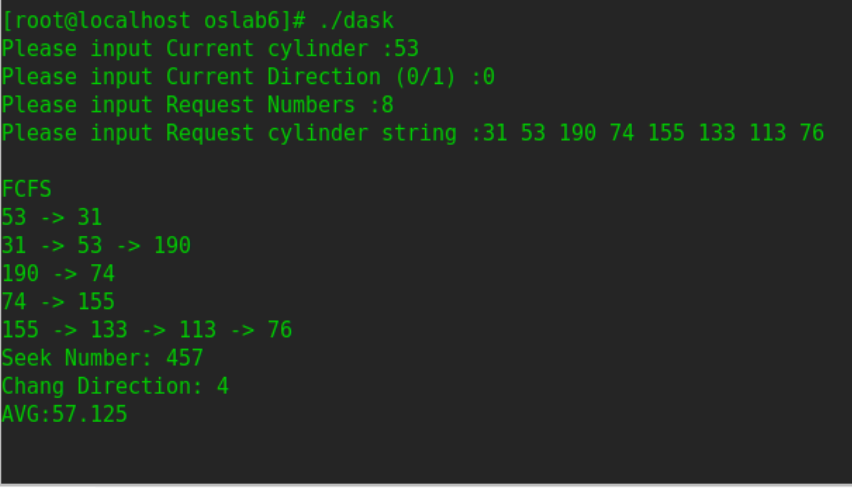
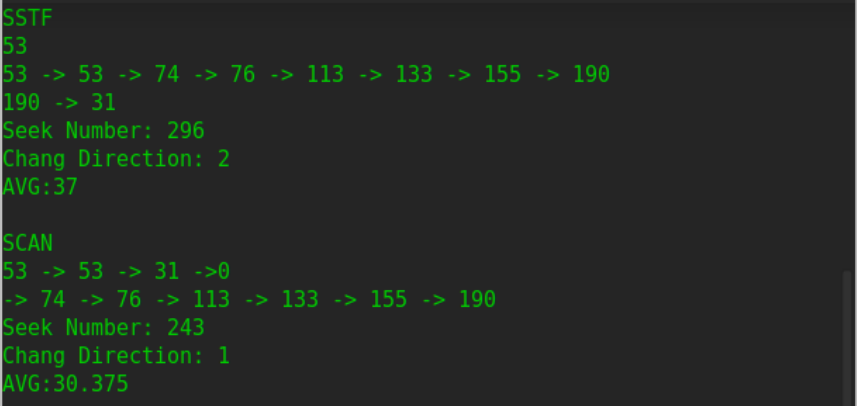
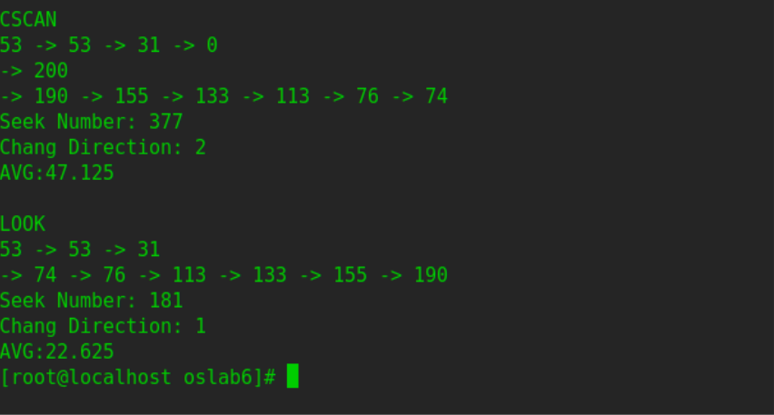
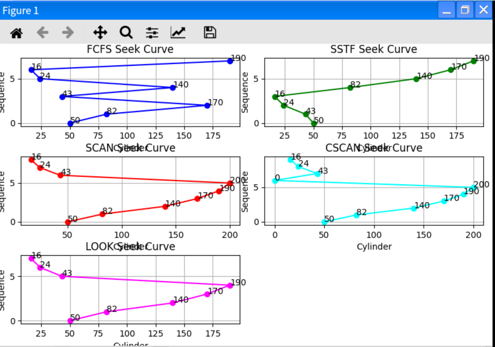
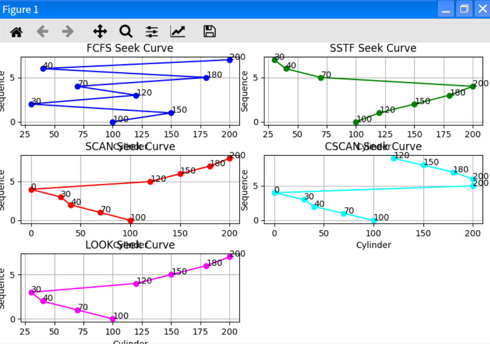
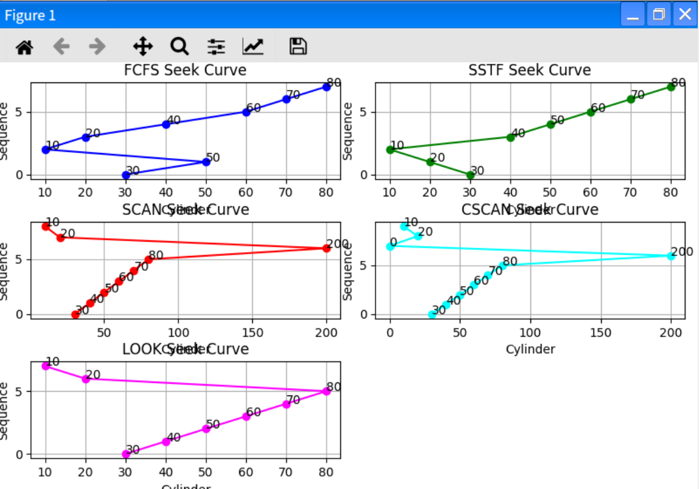

# 磁盘移臂调度算法实验

---

github地址：[https://github.com/nagyan78/bookish-spoon](https://github.com/nagyan78/bookish-spoon)

## FCFS和SSTF，及补充SCAN，C-SCAN和LOOK磁盘移臂调度算法的改进后模拟程序

```c++
/*
 * Filename : dask.cc
 * copyright : (C) 2006 by zhonghonglie
 * Function : 磁盘移臂调度算法
 */
#include "dask.h"
#include <cstdlib>
#include <ctime>
using namespace std;
DiskArm::DiskArm() {
    int i;
    // 输入当前道号
    cout << "Please input Current cylinder :";
    cin >> CurrentCylinder;
    // 磁头方向，输入 0 表示向小道号移动，1 表示向大道号移动
    cout << "Please input Current Direction (0/1) :";
    cin >> SeekDirection;
    // 输入磁盘请求数，请求道号
    cout << "Please input Request Numbers :";
    cin >> RequestNumber;
    cout << "Please input Request cylinder string :";
    Request = new int[sizeof(int) * RequestNumber];
    Cylinder = new int[sizeof(int) * RequestNumber];
    for (i = 0; i < RequestNumber; i++)
        cin >> Request[i];
    cout << endl;
}
DiskArm::~DiskArm() {}
// 初始化道号，寻道记录
void DiskArm::InitSpace(char* MethodName) {
    int i;
    cout << endl << MethodName << endl;
    SeekNumber = 0;
    SeekChang = 0;
    for (i = 0; i < RequestNumber; i++)
        Cylinder[i] = Request[i];
}
// 统计报告算法执行情况
void DiskArm::Report(void) {
    cout << endl;
    cout << "Seek Number: " << SeekNumber << endl;
    cout << "Chang Direction: " << SeekChang << endl;
    cout << "AVG:" << (float)SeekNumber / RequestNumber << endl;
}
// 先来先服务算法
void DiskArm::Fcfs(void) {
    int Current = CurrentCylinder;
    int Direction = SeekDirection;
    InitSpace("FCFS");
    cout << Current;
    for (int i = 0; i < RequestNumber; i++) {
        if (((Cylinder[i] >= Current) && !Direction) ||
            ((Cylinder[i] < Current) && Direction)) {
            // 需要调头
            SeekChang++;             // 调头数加 1
            Direction = !Direction;  // 改变方向标志
            // 报告当前响应的道号
            cout << endl << Current << " -> " << Cylinder[i];
        } else  // 不需调头，报告当前响应的道号
            cout << " -> " << Cylinder[i];
        // 累计寻道数，响应过的道号变为当前道号
        SeekNumber += abs(Current - Cylinder[i]);
        Current = Cylinder[i];
    }
    // 报告磁盘移臂调度的情况
    Report();
}
// 最短寻道时间优先算法
void DiskArm::Sstf(void) {
    int Shortest;
    int Distance = 999999;
    int Direction = SeekDirection;
    int Current = CurrentCylinder;
    InitSpace("SSTF");
    cout << Current;
    for (int i = 0; i < RequestNumber; i++) {
        // 查找当前最近道号
        for (int j = 0; j < RequestNumber; j++) {
            if (Cylinder[j] == -1)
                continue;  //-1 表示已经响应过了

            if (Distance > abs(Current - Cylinder[j])) {
                // 到下一道号比当前距离近，下一道号为当前距离
                Distance = abs(Current - Cylinder[j]);
                Shortest = j;
            }
        }
        if (((Cylinder[Shortest] >= Current) && !Direction) ||
            ((Cylinder[Shortest] < CurrentCylinder) && Direction)) {
            // 需要调头
            SeekChang++;             // 调头数加 1
            Direction = !Direction;  // 改变方向标志
            // 报告当前响应的道号
            cout << endl << Current << " -> " << Cylinder[Shortest];
        } else  // 不需调头，报告当前响应的道号
            cout << " -> " << Cylinder[Shortest];
        // 累计寻道数，响应过的道号变为当前道号
        SeekNumber += abs(Current - Cylinder[Shortest]);
        Current = Cylinder[Shortest];
        // 恢复最近距离，销去响应过的道号
        Distance = 999999;
        Cylinder[Shortest] = -1;
    }
    Report();
}

void sort(int* a, int n) {
    for (int i = 0; i < n - 1; i++) {
        for (int j = 0; j < n - i - 1; j++) {
            if (a[j] > a[j + 1]) {
                int temp = a[j + 1];
                a[j + 1] = a[j];
                a[j] = temp;
            }
        }
    }
}

// 电梯调度算法
void DiskArm::Scan(void) {
    int Current = CurrentCylinder;
    int Direction = SeekDirection;
    InitSpace("SCAN");
    int point = 0;
    for (int i = 0; i < RequestNumber; i++) {
        if (Cylinder[i] <= Current)
            point++;
    }  // 标记
    sort(Cylinder, RequestNumber);  // 升序排列
    cout << Current << " ";

    if (Direction == 0) {
        for (int i = point - 1; i >= 0; i--) {
            cout << "-> " << Cylinder[i] << " ";
        }
        cout << "->" << 0;
        SeekChang++;
        SeekNumber += abs(Current - 0);
        cout << endl;
        for (int i = point; i < RequestNumber; i++) {
            cout << "-> " << Cylinder[i] << " ";
        }
        SeekNumber += abs(Cylinder[RequestNumber - 1] - 0);
    }

    else if (Direction == 1) {
        for (int i = point; i < RequestNumber; i++) {
            cout << "-> " << Cylinder[i] << " ";
        }
        cout << "-> " << 200;
        SeekNumber += abs(200 - Current);
        SeekChang++;
        cout << endl;
        for (int i = point - 1; i >= 0; i--) {
            cout << "-> " << Cylinder[i] << " ";
        }
        SeekNumber += abs(200 - Cylinder[0]);
    }
    Report();
}

// 均匀电梯调度算法
void DiskArm::CScan(void) {
    int Current = CurrentCylinder;
    int Direction = SeekDirection;
    InitSpace("CSCAN");
    int point = 0;
    for (int i = 0; i < RequestNumber; i++) {
        if (Cylinder[i] <= Current)
            point++;
    }
    sort(Cylinder, RequestNumber);  // 升序排列
    cout << Current << " ";

    if (Direction == 0) {
        for (int i = point - 1; i >= 0; i--) {
            cout << "-> " << Cylinder[i] << " ";
        }
        cout << "-> " << 0;  // 向左到0
        cout << endl;
        cout << "-> " << 200;
        SeekChang++;
        SeekNumber += abs(Current - 0);  // 向左移动到0的距离
        SeekNumber += 200;               // 从0到200
        cout << endl;
        SeekChang++;
        for (int i = RequestNumber - 1; i >= point; i--) {
            cout << "-> " << Cylinder[i] << " ";
        }
        SeekNumber +=
            abs(200 - Cylinder[point + 1]);  // 200到最后一个访问点的距离
    }

    else if (Direction == 1) {
        for (int i = point; i < RequestNumber; i++) {
            cout << "-> " << Cylinder[i] << " ";
        }
        cout << "-> " << 200;
        cout << endl;
        cout << "-> " << 0;
        SeekNumber += abs(200 - Current) + 200;
        SeekChang++;
        cout << endl;
        SeekChang++;
        for (int i = 0; i <= point - 1; i++) {
            cout << "-> " << Cylinder[i] << " ";
        }
        SeekNumber += abs(Cylinder[point - 1] - 0);
    }
    Report();
}
// LOOK 调度算法
void DiskArm::Look(void) {
    int Current = CurrentCylinder;
    int Direction = SeekDirection;
    InitSpace("LOOK");
    int point = 0;
    for (int i = 0; i < RequestNumber; i++) {
        if (Cylinder[i] <= Current)
            point++;
    }
    sort(Cylinder, RequestNumber);  // 升序排列
    cout << Current << " ";

    if (Direction == 0) {
        for (int i = point - 1; i >= 0; i--) {
            cout << "-> " << Cylinder[i] << " ";
        }
        SeekChang++;
        SeekNumber += abs(Current - Cylinder[0]);
        cout << endl;
        for (int i = point; i < RequestNumber; i++) {
            cout << "-> " << Cylinder[i] << " ";
        }
        SeekNumber += abs(Cylinder[RequestNumber - 1] - Cylinder[0]);
    }

    else if (Direction == 1) {
        for (int i = point; i < RequestNumber; i++) {
            cout << "-> " << Cylinder[i] << " ";
        }
        SeekNumber += abs(Cylinder[RequestNumber - 1] - Current);
        SeekChang++;
        cout << endl;
        for (int i = point - 1; i >= 0; i--) {
            cout << "-> " << Cylinder[i] << " ";
        }
        SeekNumber += abs(Cylinder[RequestNumber - 1] - Cylinder[0]);
    }
    Report();
}

// 程序启动入口
int main(int argc, char* argv[]) {
    // 建立磁盘移臂调度类
    DiskArm* dask = new DiskArm();
    // 比较和分析 FCFS 和 SSTF 两种调度算法的性能
    dask->Fcfs();
    dask->Sstf();
    dask->Scan();
    dask->CScan();
    dask->Look();
}
```

### 改进 `DiskArm` 函数，使其能够*随机产生磁盘柱面请求序列*

```c++
DiskArm::DiskArm() {
    int i;
    // 输入当前道号
    cout << "Please input Current cylinder :";
    cin >> CurrentCylinder;
    // 磁头方向，输入 0 表示向小道号移动，1 表示向大道号移动
    cout << "Please input Current Direction (0/1) :";
    cin >> SeekDirection;
    // 输入磁盘请求数，请求道号
    cout << "Please input Request Numbers :";
    cin >> RequestNumber;
    cout << "Please input Request cylinder string :";
    Request = new int[sizeof(int) * RequestNumber];
    Cylinder = new int[sizeof(int) * RequestNumber];
    // 随机产生磁盘柱面请求序列
    srand(static_cast<unsigned>(time(0)));
    for (int i = 0; i < RequestNumber; i++) {
        // 假设磁道号范围为 0-199
        Request[i] = rand() % 200;
    }
    for (int j = 0; j < RequestNumber; j++) {
        cout << Request[j] << " ";
    }
    cout << endl;
}
```

## 测试及现象

### 随机案例截图





### 测试案例 1

  * **输入** ：
    ```
Please input Current cylinder :50
Please input Current Direction (0/1) :1
Please input Request Numbers :7
Please input Request cylinder string :82 170 43 140 24 16 190
    ```

  * **现象结果说明** ：

    * **FCFS算法** ：磁头从 50 道开始，依次访问 82、170、43、140、24、16、190 道。寻道顺序为 50->82->170->43->140->24->16->190。总寻道距离为 |50-82| + |82-170| + |170-43| + |43-140| + |140-24| + |24-16| + |16-190|=32+88+127+97+116+8+174=632。方向改变次数为 0，因为没有判断需要调头的情况。
    * **SSTF算法** ：磁头从 50 道开始，先找距离最近的 43 道，然后依次找最近的 24、16、82、140、170、190 道。寻道顺序为 50->43->24->16->82->140->170->190。总寻道距离为 |50-43| + |43-24| + |24-16| + |16-82| + |82-140| + |140-170| + |170-190|=7+19+8+66+58+30+20=208。方向改变次数为 1，在从 16 道转向 82 道时方向改变。
    * **SCAN算法** ：磁头方向为向大道号移动。从 50 道开始向大道号方向移动，访问 82、140、170、190 道，到达端点 200 后（假设最大道号为 200），改变方向，向小道号移动，访问 43、24、16 道。寻道顺序为 50->82->140->170->190->200->43->24->16。总寻道距离为 |50-82| + |82-140| + |140-170| + |170-190| + |190-200| + |200-43| + |43-24| + |24-16|=32+58+30+20+10+157+19+8= 334。方向改变次数为 1，在到达端点 200 后改变方向。
    * **C-SCAN算法** ：磁头方向为向大道号移动。从 50 道开始向大道号方向移动，访问 82、140、170、190 道，到达端点 200 后，直接返回到 0 道（假设最小道号为 0），再改变方向向大道号移动，访问 43、24、16 道。寻道顺序为 50->82->140->170->190->200->0->43->24->16。总寻道距离为 |50-82| + |82-140| + |140-170| + |170-190| + |190-200| + |200-0| + |0-43| + |43-24| + |24-16|=32+58+30+20+10+200+43+19+8= 430。方向改变次数为 2，在到达端点 200 后改变方向到小道号方向，在到达 0 道后又改变方向到大道号方向。
    * **LOOK算法** ：磁头方向为向大道号移动。从 50 道开始向大道号方向移动，访问 82、140、170、190 道，到达最远请求道号 190 后，改变方向向小道号移动，访问 43、24、16 道。寻道顺序为 50->82->140->170->190->43->24->16。总寻道距离为 |50-82| + |82-140| + |140-170| + |170-190| + |190-43| + |43-24| + |24-16|=32+58+30+20+147+19+8= 296。方向改变次数为 1，在到达最远请求道号 190 后改变方向。

### 测试案例 2

  * **输入** ：
    ```
Please input Current cylinder :100
Please input Current Direction (0/1) :0
Please input Request Numbers :7
Please input Request cylinder string :150 30 120 70 180 40 200
    ```

  * **现象结果说明** ：
    * **FCFS算法** ：磁头从 100 道开始，依次访问 150、30、120、70、180、40、200 道。寻道顺序为 100->150->30->120->70->180->40->200。总寻道距离为 |100-150| + |150-30| + |30-120| + |120-70| + |70-180| + |180-40| + |40-200|=50+120+90+50+110+140+160= 720。方向改变次数为 0。
    * **SSTF算法** ：磁头从 100 道开始，先找距离最近的 70 道，然后依次找最近的 40、30、120、150、180、200 道。寻道顺序为 100->70->40->30->120->150->180->200。总寻道距离为 |100-70| + |70-40| + |40-30| + |30-120| + |120-150| + |150-180| + |180-200|=30+30+10+90+30+30+20= 220。方向改变次数为 1，在从 30 道转向 120 道时方向改变。
    * **SCAN算法** ：磁头方向为向小道号移动。从 100 道开始向小道号方向移动，访问 70、40、30 道，到达端点 0 后（假设最小道号为 0），改变方向向大道号移动，访问 120、150、180、200 道。寻道顺序为 100->70->40->30->0->120->150->180->200。总寻道距离为 |100-70| + |70-40| + |40-30| + |30-0| + |0-120| + |120-150| + |150-180| + |180-200|=30+30+10+30+120+30+30+20= 300。方向改变次数为 1，在到达端点 0 后改变方向。
    * **C-SCAN算法** ：磁头方向为向小道号移动。从 100 道开始向小道号方向移动，访问 70、40、30 道，到达端点 0 后，直接返回到最大道号 200，再改变方向向小道号移动，访问 120、150、180 道。寻道顺序为 100->70->40->30->0->200->120->150->180。总寻道距离为 |100-70| + |70-40| + |40-30| + |30-0| + |0-200| + |200-120| + |120-150| + |150-180|=30+30+10+30+200+80+30+30= 440。方向改变次数为 2，在到达端点 0 后改变方向到大道号方向，在到达 200 道后又改变方向到小道号方向。
    * **LOOK算法** ：磁头方向为向小道号移动。从 100 道开始向小道号方向移动，访问 70、40、30 道，到达最远请求道号 30 后，改变方向向大道号移动，访问 120、150、180、200 道。寻道顺序为 100->70->40->30->120->150->180->200。总寻道距离为 |100-70| + |70-40| + |40-30| + |30-120| + |120-150| + |150-180| + |180-200|=30+30+10+90+30+30+20= 220。方向改变次数为 1，在到达最远请求道号 30 后改变方向。

### 测试案例 3

  * **输入** ：
    ```
Please input Current cylinder :30
Please input Current Direction (0/1) :1
Please input Request Numbers :7
Please input Request cylinder string :50 10 20 40 60 70 80
    ```

  * **现象结果说明** ：
    * **FCFS算法** ：磁头从 30 道开始，依次访问 50、10、20、40、60、70、80 道。寻道顺序为 30->50->10->20->40->60->70->80。总寻道距离为 |30-50| + |50-10| + |10-20| + |20-40| + |40-60| + |60-70| + |70-80|=20+40+10+20+20+10+10= 130。方向改变次数为 0。
    * **SSTF算法** ：磁头从 30 道开始，先找距离最近的 20 道，然后依次找最近的 10、40、50、60、70、80 道。寻道顺序为 30->20->10->40->50->60->70->80。总寻道距离为 |30-20| + |20-10| + |10-40| + |40-50| + |50-60| + |60-70| + |70-80|=10+10+30+10+10+10+10= 90。方向改变次数为 1，在从 10 道转向 40 道时方向改变。
    * **SCAN算法** ：磁头方向为向大道号移动。从 30 道开始向大道号方向移动，访问 40、50、60、70、80 道，到达端点 200 后（假设最大道号为 200），改变方向向小道号移动，访问 20、10 道。寻道顺序为 30->40->50->60->70->80->200->20->10。总寻道距离为 |30-40| + |40-50| + |50-60| + |60-70| + |70-80| + |80-200| + |200-20| + |20-10|=10+10+10+10+10+120+180+10= 360。方向改变次数为 1，在到达端点 200 后改变方向。
    * **C-SCAN算法** ：磁头方向为向大道号移动。从 30 道开始向大道号方向移动，访问 40、50、60、70、80 道，到达端点 200 后，直接返回到最小道号 0，再改变方向向大道号移动，访问 20、10 道。寻道顺序为 30->40->50->60->70->80->200->0->20->10。总寻道距离为 |30-40| + |40-50| + |50-60| + |60-70| + |70-80| + |80-200| + |200-0| + |0-20| + |20-10|=10+10+10+10+10+120+200+20+10= 410。方向改变次数为 2，在到达端点 200 后改变方向到小道号方向，在到达 0 道后又改变方向到大道号方向。
    * **LOOK算法** ：磁头方向为向大道号移动。从 30 道开始向大道号方向移动，访问 40、50、60、70、80 道，到达最远请求道号 80 后，改变方向向小道号移动，访问 20、10 道。寻道顺序为 30->40->50->60->70->80->20->10。总寻道距离为 |30-40| + |40-50| + |50-60| + |60-70| + |70-80| + |80-20| + |20-10|=10+10+10+10+10+60+10= 130。方向改变次数为 1，在到达最远请求道号 80 后改变方向。


## 不同算法的寻道曲线图
```python
import matplotlib.pyplot as plt

class DiskArmSimulator:
    def __init__(self, current_cylinder, seek_direction, request_sequence):
        self.current_cylinder = current_cylinder
        self.seek_direction = seek_direction
        self.request_sequence = request_sequence.copy()

    def fcfs(self):
        current = self.current_cylinder
        sequence = [current]
        for cylinder in self.request_sequence:
            sequence.append(cylinder)
        return sequence

    def sstf(self):
        current = self.current_cylinder
        sequence = [current]
        remaining_requests = self.request_sequence.copy()
        while remaining_requests:
            shortest_distance = float('inf')
            next_cylinder = None
            for cylinder in remaining_requests:
                distance = abs(current - cylinder)
                if distance < shortest_distance:
                    shortest_distance = distance
                    next_cylinder = cylinder
            sequence.append(next_cylinder)
            remaining_requests.remove(next_cylinder)
            current = next_cylinder
        return sequence

    def scan(self):
        current = self.current_cylinder
        direction = self.seek_direction
        point = 0
        for i in range(len(self.request_sequence)):
            if self.request_sequence[i] <= current:
                point += 1
        sorted_cylinder = sorted(self.request_sequence)
        sequence = [current]
        if direction == 0:
            for i in range(point - 1, -1, -1):
                sequence.append(sorted_cylinder[i])
            sequence.append(0)
            for i in range(point, len(self.request_sequence)):
                sequence.append(sorted_cylinder[i])
        else:
            for i in range(point, len(self.request_sequence)):
                sequence.append(sorted_cylinder[i])
            sequence.append(200)
            for i in range(point - 1, -1, -1):
                sequence.append(sorted_cylinder[i])
        return sequence

    def cscan(self):
        current = self.current_cylinder
        direction = self.seek_direction
        point = 0
        for i in range(len(self.request_sequence)):
            if self.request_sequence[i] <= current:
                point += 1
        sorted_cylinder = sorted(self.request_sequence)
        sequence = [current]
        if direction == 0:
            for i in range(point - 1, -1, -1):
                sequence.append(sorted_cylinder[i])
            sequence.append(0)
            sequence.append(200)
            for i in range(len(self.request_sequence) - 1, point - 1, -1):
                sequence.append(sorted_cylinder[i])
        else:
            for i in range(point, len(self.request_sequence)):
                sequence.append(sorted_cylinder[i])
            sequence.append(200)
            sequence.append(0)
            for i in range(point - 1, -1, -1):
                sequence.append(sorted_cylinder[i])
        return sequence

    def look(self):
        current = self.current_cylinder
        direction = self.seek_direction
        point = 0
        for i in range(len(self.request_sequence)):
            if self.request_sequence[i] <= current:
                point += 1
        sorted_cylinder = sorted(self.request_sequence)
        sequence = [current]
        if direction == 0:
            for i in range(point - 1, -1, -1):
                sequence.append(sorted_cylinder[i])
            for i in range(point, len(self.request_sequence)):
                sequence.append(sorted_cylinder[i])
        else:
            for i in range(point, len(self.request_sequence)):
                sequence.append(sorted_cylinder[i])
            for i in range(point - 1, -1, -1):
                sequence.append(sorted_cylinder[i])
        return sequence

def plot_seek_curves(current_cylinder, seek_direction, request_sequence):
    simulator = DiskArmSimulator(current_cylinder, seek_direction, request_sequence)
    algorithms = {
        'FCFS': simulator.fcfs(),
        'SSTF': simulator.sstf(),
        'SCAN': simulator.scan(),
        'CSCAN': simulator.cscan(),
        'LOOK': simulator.look()
    }
    plt.figure(figsize=(12, 8))
    colors = ['blue', 'green', 'red', 'cyan', 'magenta']
    for idx, (alg_name, sequence) in enumerate(algorithms.items()):
        plt.subplot(3, 2, idx + 1)
        y = list(range(len(sequence)))
        plt.plot(sequence, y, marker='o', linestyle='-', color=colors[idx % len(colors)])
        plt.title(f'{alg_name} Seek Curve')
        plt.xlabel('Cylinder')
        plt.ylabel('Sequence')
        plt.grid(True)
        for i, txt in enumerate(sequence):
            plt.annotate(txt, (sequence[i], y[i]))
    plt.tight_layout()
    plt.show()

if __name__ == "__main__":
    test_cases = [
        {
            "current_cylinder": 50,
            "seek_direction": 1,
            "request_sequence": [82, 170, 43, 140, 24, 16, 190]
        },
        {
            "current_cylinder": 100,
            "seek_direction": 0,
            "request_sequence": [150, 30, 120, 70, 180, 40, 200]
        },
        {
            "current_cylinder": 30,
            "seek_direction": 1,
            "request_sequence": [50, 10, 20, 40, 60, 70, 80]
        }
    ]
    for idx, test_case in enumerate(test_cases):
        print(f"Test Case {idx + 1}:")
        print(f"Current cylinder: {test_case['current_cylinder']}")
        print(f"Seek direction: {test_case['seek_direction']}")
        print(f"Request sequence: {test_case['request_sequence']}")
        plot_seek_curves(
            test_case['current_cylinder'],
            test_case['seek_direction'],
            test_case['request_sequence']
        )
```

在上面的代码中，我使用了三组不同的测试用例来展示寻道曲线的变化，以下是每组测试用例的具体介绍：

### 第一组测试用例
- **当前道号**：50
- **寻道方向**：1（表示向大道号移动）
- **请求道号序列**：\[82, 170, 43, 140, 24, 16, 190\]

这组测试用例旨在展示磁头从道号 50 开始，向大道号方向移动时的寻道行为。请求道号序列包含了比当前道号大的道号（如 82、170 等）和比当前道号小的道号（如 43、24 等），用于观察不同调度算法在混合请求下的表现。




### 第二组测试用例
- **当前道号**：100
- **寻道方向**：0（表示向小道号移动）
- **请求道号序列**：\[150, 30, 120, 70, 180, 40, 200\]

这组测试用例展示了磁头从道号 100 开始，向小道号方向移动的情况。请求道号序列同样包含了比当前道号大和小的道号，用于进一步分析不同调度算法在不同初始方向下的寻道效率和路径差异。



### 第三组测试用例
- **当前道号**：30
- **寻道方向**：1（表示向大道号移动）
- **请求道号序列**：\[50, 10, 20, 40, 60, 70, 80\]

这组测试用例中，磁头从道号 30 开始向大道号方向移动。请求道号序列中的道号相对比较密集且呈递增趋势，用于观察在较为规整的请求分布下，各种调度算法的寻道路径有何不同，以及它们如何处理连续递增的道号请求。



## 模拟说明

### 电梯调度算法（SCAN）

- **模拟过程** :
    - **初始化** ：在 `Scan()` 函数中，首先调用 `InitSpace("SCAN")` 进行初始化，将请求道号复制到 `Cylinder` 数组，并重置寻道计数和方向改变计数。
    - **确定起始点** ：计算 `point`，表示小于等于当前道号 `CurrentCylinder` 的请求数量。这有助于确定磁头开始移动的方向和起始位置。
    - **排序** ：将 `Cylinder` 数组中的请求道号进行升序排序，以便按照顺序处理请求。
    - **根据方向处理请求** ：
        - **方向 0（向小道号移动）** ：磁头从当前道号开始，先向小道号方向移动，依次处理小于等于当前道号的请求（从 `point - 1` 开始向前遍历）。处理完这些请求后，磁头移动到道号 0，这算作一次方向改变，同时计算相应的寻道距离并累加到 `SeekNumber`。然后，磁头改变方向，向大道号方向移动，依次处理剩余的请求（从 `point` 开始向后遍历），并累加寻道距离。
        - **方向 1（向大道号移动）** ：磁头从当前道号开始，先向大道号方向移动，依次处理大于当前道号的请求（从 `point` 开始向后遍历）。处理完这些请求后，磁头移动到道号 200，这算作一次方向改变，同时计算相应的寻道距离并累加。然后，磁头改变方向，向小道号方向移动，依次处理剩余的请求（从 `point - 1` 开始向前遍历），并累加寻道距离。
    - **报告结果** ：调用 `Report()` 函数输出寻道总数、方向改变次数和平均寻道距离。

### 循环电梯调度算法（C-SCAN）
- **模拟过程** ：
    - **初始化** ：在 `CScan()` 函数中，调用 `InitSpace("CSCAN")` 进行初始化。
    - **确定起始点和排序** ：与 SCAN 算法类似，计算 `point` 并对 `Cylinder` 数组进行排序。
    - **根据方向处理请求** ：
        - **方向 0** ：磁头从当前道号开始，向小道号方向移动，处理小于等于当前道号的请求。之后，磁头直接移动到道号 0，再移动到道号 200（这算作两次方向改变），计算并累加相应的寻道距离。然后，磁头从道号 200 开始，向小道号方向移动，处理剩余的请求，并累加寻道距离。
        - **方向 1** ：磁头从当前道号开始，向大道号方向移动，处理大于当前道号的请求。之后，磁头移动到道号 200，再移动到道号 0（这算作两次方向改变），计算并累加寻道距离。然后，磁头从道号 0 开始，向大道号方向移动，处理剩余的请求，并累加寻道距离。
    - **报告结果** ：调用 `Report()` 函数输出结果。

### LOOK 调度算法
- **模拟过程** ：
    - **初始化** ：在 `Look()` 函数中，调用 `InitSpace("LOOK")` 进行初始化。
    - **确定起始点和排序** ：计算 `point` 并对 `Cylinder` 数组排序。
    - **根据方向处理请求** ：
        - **方向 0** ：磁头从当前道号开始，向小道号方向移动，处理小于等于当前道号的请求。处理完后，改变方向，向大道号方向移动，处理剩余的请求。计算并累加寻道距离，方向改变次数加 1。
        - **方向 1** ：磁头从当前道号开始，向大道号方向移动，处理大于当前道号的请求。处理完后，改变方向，向小道号方向移动，处理剩余的请求。计算并累加寻道距离，方向改变次数加 1。
    - **报告结果** ：调用 `Report()` 函数输出结果。

程序通过这些逻辑结构和操作步骤，能够有效地模拟磁盘移臂调度算法的行为，帮助用户理解不同算法的工作原理和性能特点。
## 分析各种算法各适应于怎样的磁盘柱面寻道请求情况

### 先来先服务（FCFS）算法
- **逻辑**：按照请求到达的先后顺序依次处理。磁头依次访问请求队列中的道号，不管其位置如何，总是先处理最早发出的请求。
- **适用情景**：
    - 在请求队列较短且请求分布较为均匀的情况下，能够保证公平性，先到的请求先得到服务。
    - 对于对实时性要求不高且请求量不大的简单应用场景，如小型嵌入式设备的磁盘访问。

### 最短寻道时间优先（SSTF）算法
- **逻辑**：每次选择距离磁头当前位置最近的道号进行访问，以减少寻道时间。通过不断寻找当前最近的请求来优化磁头移动距离，但可能会导致某些请求长期等待。
- **适用情景**：
    - 在请求队列中存在大量分散的请求时，能有效减少磁头的移动距离，提高整体的磁盘访问效率。
    - 对于需要快速响应多个随机分布的磁盘请求、对平均寻道时间较为敏感的应用场景，如数据库系统中的随机数据读写操作。

### 电梯调度（SCAN）算法
- **逻辑**：磁头沿一个方向移动，依次访问途经的道号请求，直到到达磁盘的端点后，改变移动方向，再依次访问剩余的道号请求。类似于电梯的运行方式，先向一个方向移动处理请求，再反向处理。
- **适用情景**：
    - 当磁盘请求分布较为广泛且磁头需要频繁在磁盘的不同区域来回移动时，能够有计划地访问道号，减少磁头的往返移动。
    - 适用于磁盘负载较高、请求分布较为随机且需要平衡磁头移动效率和请求处理公平性的场景，如服务器的磁盘I/O调度。

### 循环电梯调度（C-SCAN）算法
- **逻辑**：类似于SCAN算法，但当磁头移动到磁盘的一端后，不是立即反向，而是直接返回另一端的端点，再开始反向处理请求。形成一种循环的扫描方式。
- **适用情景**：
    - 在磁盘请求主要集中在某一区域且磁头需要高效地循环扫描该区域时，能减少磁头在端点处的不必要的反向移动。
    - 对于对磁头移动的稳定性要求较高且请求分布有一定规律性的场景，如一些特定的数据存储设备的内部磁盘调度。

### LOOK算法
- **逻辑**：与SCAN算法类似，但在到达最远请求道号后立即改变方向，而不是到物理端点才改变方向。只需要处理当前方向上的请求，直到没有剩余请求为止。
- **适用情景**：
    - 当磁盘请求相对集中在某个范围内且不需要访问磁盘的全部道号时，可以减少磁头移动到端点的空跑距离，提高效率。
    - 适用于对磁头移动效率有一定要求且请求分布相对紧凑的应用场景，如一些小型文件系统的磁盘访问调度。

## 心得体会

- 在代码实现过程中，需要注意对各种边界情况的处理，如请求队列为空、请求道号超出磁盘范围等，以确保算法的健壮性和可靠性。
- 测试过程中，通过多组不同的测试用例，能够更全面地评估和比较不同调度算法的性能特点。同时，也可以发现算法在某些特定场景下的潜在问题和改进空间。
- 直观的图表能够帮助我们更好地理解算法的寻道行为和性能差异。通过调整图表的显示方式和参数，可以更清晰地展示寻道路径的变化和特点，为算法的分析和优化提供有力的支持。
