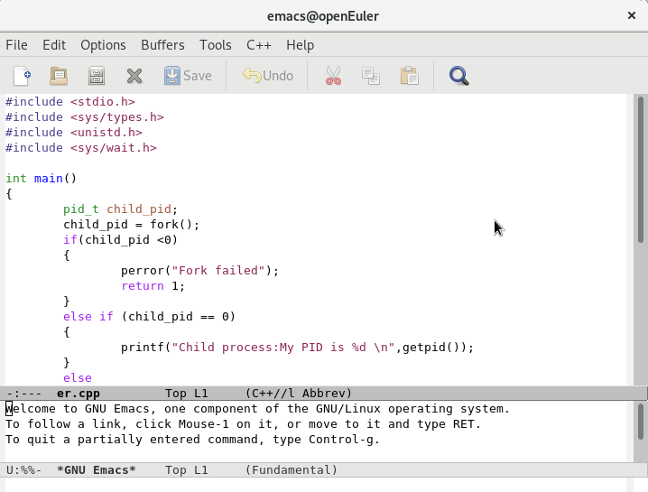

# Linux 环境下进程操作示例代码

## 获取进程 ID

### 编辑代码

在已部署好的 Linux 环境中，打开终端，输入以下命令来编写代码：

```bash
vi yi.cpp
```

输入以下代码：

```cpp
#include<stdio.h>
#include<sys/types.h>
#include<unistd.h>

int main()
{
    pid_t my_pid;
    my_pid = getpid();
    printf("My process ID is %d\n", my_pid);

    return 0;
}
```

### 编译与运行

保存并退出，输入以下命令编译并运行程序：

```bash
g++ yi.cpp -o yi
./yi
```

### 运行结果

代码及运行结果如图所示：

- 代码：
- 结果：

---

## 进程创建与父子进程关系

### 编辑代码

打开终端，输入以下命令来编写代码：

```bash
vi er.cpp
```

输入以下代码：

```cpp
#include <stdio.h>
#include <sys/types.h>
#include <unistd.h>

int main()
{
    pid_t child_pid;
    child_pid = fork();
    if (child_pid < 0)
    {
        perror("Fork failed");
        return 1;
    }
    else if (child_pid == 0)
    {
        printf("Child process: My PID is %d \n", getpid());
    }
    else
    {
        printf("Parent process: My PID is %d \n", getpid());
        printf("Parent process: Child process ID is %d \n", child_pid);
    }
    return 0;
}
```

### 编译与运行

保存并退出，输入以下命令编译并运行程序：

```bash
g++ er.cpp -o er
./er
```

### 运行结果

代码及运行结果如图所示：

- 代码：
- 结果：

---

## 父进程等待子进程退出

### 编辑代码

打开终端，输入以下命令来编写代码：

```bash
vi san.cpp
```

输入以下代码：

```cpp
#include <stdio.h>
#include <sys/types.h>
#include <unistd.h>
#include <sys/wait.h>

int main()
{
    pid_t child_pid;
    child_pid = fork();
    if (child_pid < 0)
    {
        perror("Fork failed");
        return 1;
    }
    else if (child_pid == 0)
    {
        printf("Child process: My PID is %d \n", getpid());
    }
    else
    {
        printf("Parent process: Child process ID is %d \n", child_pid);
        int status;
        waitpid(child_pid, &status, 0);
        if (WIFEXITED(status))
        {
            printf("Parent process: Child exited with status %d\n", WEXITSTATUS(status));
        }
    }
    return 0;
}
```

### 编译与运行

保存并退出，输入以下命令编译并运行程序：

```bash
g++ san.cpp -o san
./san
```

### 运行结果

代码及运行结果如图所示：

- 代码 1：
- 代码 2：
- 结果：

---

## 多次 `fork()` 进程创建

### 编辑代码

打开终端，输入以下命令来编写代码：

```bash
vi si.cpp
```

输入以下代码：

```cpp
#include<stdio.h>
#include<sys/types.h>
#include<unistd.h>

int main()
{
    fork();
    fork();
    fork();
    printf("Hello\n");
    return 0;
}
```

### 编译与运行

保存并退出，输入以下命令来创建一个用来保存结果的文件 `save.txt`：

```bash
touch save.txt
```

运行程序并将输出重定向到文件：

```bash
g++ si.cpp -o si
./si > save.txt
```

### 运行结果

运行结果如图所示：

- 结果 1：
- 结果 2：

---

## 进程独立性

### 编辑代码

打开终端，输入以下命令来编写代码：

```bash
vi wu.cpp
```

输入以下代码：

```cpp
#include <stdio.h>
#include <sys/types.h>
#include <unistd.h>
#include <stdlib.h>

int main()
{
    int x = 1;
    pid_t p = fork();
    if (p < 0)
    {
        perror("fork fail");
        exit(1);
    }
    else if (p == 0)
        printf("Child has x = %d \n", ++x);
    else
        printf("Parent has x = %d\n", --x);

    return 0;
}
```

### 编译与运行

保存并退出，输入以下命令编译并运行程序：

```bash
g++ wu.cpp -o wu
./wu
```

### 运行结果

运行结果如图所示：

- 结果：

---

## 总结

1. **进程的基本概念**
   - 进程是程序的一个执行实例，是操作系统分配系统资源（如 CPU 时间、内存）的基本单位。
   - 每个进程都有一个唯一的标识符（PID），用于区分不同的进程。

2. **进程控制块（PCB）**
   - 在 Linux 中，进程控制块用 `task_struct` 数据结构表示，包含进程的所有属性，如 PID、状态、优先级等。

3. **进程状态**
   - Linux 中的进程状态包括：
     - **运行（Running）**：进程正在执行。
     - **睡眠（Sleeping）**：进程等待某事件发生。
     - **阻塞（Blocked）**：进程因等待资源而暂停。
     - **僵死（Zombie）**：进程已结束，但父进程尚未回收其资源。
     - **停止（Stopped）**：进程被暂停执行。

4. **进程创建**
   - 使用 `fork()` 系统调用创建子进程，子进程是父进程的副本，共享代码段，但拥有独立的内存空间。
   - `fork()` 返回值：在父进程中返回子进程的 PID，在子进程中返回 0。

5. **父子进程关系**
   - 父进程和子进程通过 PID 和 PPID（父进程的 PID）关联。
   - 子进程具有独立性，即使父进程退出，子进程仍可继续运行。

6. **进程管理工具**
   - `ps`：显示当前系统中的进程信息。
   - `top`：实时显示系统中运行的进程状态。
   - `kill`：向进程发送信号以终止、重启或暂停进程。
   - `pidof` 和 `pgrep`：查找指定进程的 PID。

7. **进程优先级**
   - Linux 中的进程优先级范围从 -20（最高优先级）到 19（最低优先级），数值越低，获得 CPU 时间片的机会越多。

8. **进程的独立性**
   - 父进程和子进程在内存空间上是独立的，即使共享代码段，数据段和堆栈段是独立的。