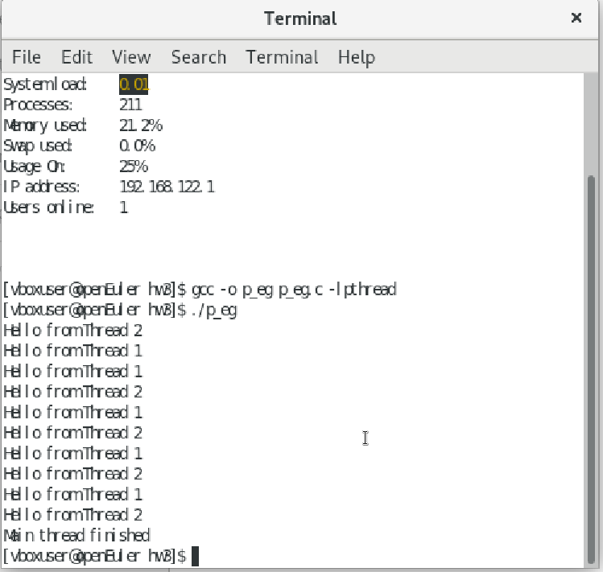

# 基于 `pthread` 库的实践编程以及使用 `git` 工具管理项目的详细指南。

## 一、在 Linux 环境下使用 `pthread` 编程

### 1. 环境准备
确保你的 Linux 虚拟机已经安装了必要的开发工具，包括 `gcc` 编译器和 `pthread` 库（通常默认已安装）。

- 打开终端，运行以下命令安装 `gcc`（如果尚未安装）：
  ```bash
  sudo apt update
  sudo apt install build-essential
  ```

### 2. 编写多线程代码
以下是一个简单的多线程示例代码，使用 `pthread` 创建两个线程，分别打印消息。

#### 代码：`p_eg_.c`
```c
#include <stdio.h>
#include <pthread.h>
#include <unistd.h>

// 线程函数
void* print_message(void* arg) {
    char* message = (char*)arg;
    for (int i = 0; i < 5; i++) {
        printf("%s\n", message);
        sleep(1); // 模拟耗时操作
    }
    return NULL;
}

int main() {
    pthread_t thread1, thread2;
    char* message1 = "Hello from Thread 1";
    char* message2 = "Hello from Thread 2";

    // 创建线程
    if (pthread_create(&thread1, NULL, print_message, (void*)message1) != 0) {
        perror("Failed to create thread 1");
        return 1;
    }
    if (pthread_create(&thread2, NULL, print_message, (void*)message2) != 0) {
        perror("Failed to create thread 2");
        return 1;
    }

    // 等待线程结束
    pthread_join(thread1, NULL);
    pthread_join(thread2, NULL);

    printf("Main thread finished\n");
    return 0;
}
```
- 代码：

### 3. 编译和运行
在终端中，使用以下命令编译和运行代码：
```bash
gcc -o p_eg p_eg_.c -lpthread
./p_eg
```

- `-lpthread` 是链接 `pthread` 库的选项，确保程序能够正确使用线程功能。
  
- 结果：

## 二、使用 `git` 管理项目

### 1. 安装 `git`
在终端中运行以下命令安装 `git`：
```bash
sudo apt update
sudo apt install git
```

### 2. 配置 `git`
配置你的用户名和邮箱，这将用于记录提交信息：
```bash
git config --global user.name "Your Name"
git config --global user.email "your_email@example.com"
```

### 3. 创建并初始化项目
在你的主目录下创建一个新的项目目录，并初始化 `git` 仓库。

```bash
mkdir os_practice
cd os_practice
git init
```

### 4. 创建子目录并管理代码
每次进行新的实践任务时，创建一个单独的子目录，并将代码放入其中。

#### 示例：
假设你正在进行第一次实践任务：
```bash
mkdir hw3
cd hw3
```

将你的代码文件（如 `p_eg.c`）放入该目录中。

### 5. 使用 `git` 管理代码
每次修改代码后，使用以下命令提交到 `git` 仓库：

```bash
# 添加文件到暂存区
git add p_eg.c

# 提交到仓库
git commit -m "Added p_eg code for hw3"
```

### 6. 查看项目历史
随时查看项目的提交历史：
```bash
git log
```

### 7. 推送到远程仓库
如果想要将代码备份到远程仓库（如 GitHub），可以按照以下步骤操作：

1. 在 GitHub 上创建一个新的仓库。
2. 将本地仓库与远程仓库关联：
   ```bash
   git remote add origin https://github.com/yourusername/your-repo-name.git
   ```
3. 推送代码到远程仓库：
   ```bash
   git push -u origin master
   ```

### 8. 查看配置
查看当前的配置信息：
    ```bash
    git config --list
    ```
- 结果：